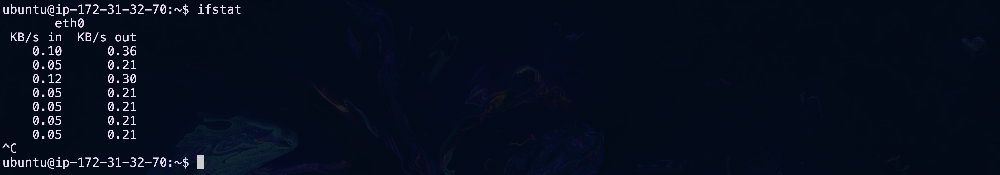

## Introducción

Para este punto del taller, se espera que tengas un conocimiento básico sobre qué es Linux y que cuentes con un servidor configurado en una máquina virtual o en la nube. Se recomienda que tu servidor tenga la última versión de Ubuntu Server LTS (aunque un buen administrador de servidores Linux debería poder moverse cómodamente entre varias versiones del sistema, no solo Ubuntu, por el momento Ubuntu es un buen primer acercamiento).

Una vez que hayas alcanzado un buen nivel de manejo de la línea de comandos, te darás cuenta de que tus habilidades son útiles no solo en todas las variantes estándar de Linux, sino que las puedes extrapolar a Android, OSx de Apple, OpenBSD, Solaris y IBM AIX. A lo largo del taller estarás trabajando en Linux, pero la mayoría de lo que aprenderás es aplicable a cualquier sistema derivado de [UNIX](https://youtu.be/tc4ROCJYbm0?si=UCENI-WS2zKO6NkQ).

## Tus tareas para este módulo:
- Conectarse a tu servidor mediante un cliente SSH.
- Ejecutar unos cuantos comandos para ver el estado de tu servidor.

## Uso de un cliente SSH

El acceso remoto solía realizarse mediante un protocolo llamado [Telnet](https://wiki.texto-plano.xyz/doku.php?id=telnet#:~:text=El%20protocolo%20Telnet%20fue%20desarrollado,de%20cómputo%20de%20tiempo%20compartido.), pero ahora siempre se utiliza el protocolo SSH (Secure SHell), que es mucho más seguro.

Saber cómo usar un cliente SSH es una habilidad básica de cualquier administrador de sistemas. Recuerda que al hablar de un "cliente", nos referimos al sistema que le solicita algo al "servidor". En este caso, solicitaremos una conexión *remota* (es remota porque no requiere de un cable directo entre nuestro cliente y servidor, sino que puede establecerse mediante una conexión de red).

El cliente SSH no depende del servidor, sino del equipo en el que estemos trabajando. Asumiremos que se está trabajando en una PC con Windows o macOS. Dichos sistemas, en sus últimas versiones, suelen tener instalado un cliente SSH en su respectiva línea de comandos. Sin embargo, también es posible instalar clientes externos como [PuTTY](https://www.chiark.greenend.org.uk/~sgtatham/putty/latest.html), [Solar-PuTTY](https://www.solarwinds.com/free-tools/solar-putty?irgwc=1&CMP=BIZ-TAD-SWTH-SW_WW_X_X_PPD_FT_EN_0_0-FSPTY-X_0_X_X_X_X-X), [MobaXterm](https://mobaxterm.mobatek.net), [Termius](https://termius.com/free-ssh-client-for-windows), entre otros.

En este taller haremos uso de las opciones nativas de los sistemas, pero si hay algún estudiante con una versión inferior a Windows 10, le sugerimos instalar [PuTTY](https://www.chiark.greenend.org.uk/~sgtatham/putty/latest.html).

### Acceder a la terminal de nuestro equipo

!!! tip "Términos confusos"
    La definición exhaustiva de qué es una **terminal** y qué es una **shell** suele ser confusa para los que nos iniciamos en estos temas. Para fines prácticos, emplearemos los términos siguientes como sinónimos, pero estrictamente hablando son cosas distintas:

    - **Terminal**
    - **Línea de comandos** 
    - **Shell**
    - **Consola**
    - **Intérprete de comandos**

??? note "¿Qué es una Shell?"
    Es un programa informático que proporciona una interfaz de línea de comandos dentro de una terminal virtual para que los usuarios interactúen con el sistema operativo. La shell interpreta los comandos ingresados por el usuario y los ejecuta. Proporciona un entorno en el que los usuarios pueden ejecutar programas, acceder a archivos, administrar procesos y realizar diversas tareas del sistema. Algunos ejemplos de shells populares son Bash (Bourne Again Shell) en sistemas Unix/Linux y PowerShell en Windows (Z Shell).

??? note "¿Qué es una Terminal?"
    Es un dispositivo físico o una interfaz de software (terminal virtual) que permite a un usuario interactuar con un sistema informático a través de una línea de comandos. En el pasado, los terminales eran dispositivos físicos que se conectaban a los mainframes o servidores a través de cables.
    En la actualidad, al referirnos a terminales nos solemos referir a terminales virtuales.

El cliente SSH no es más que un software con una peculiaridad **NO tiene interfaz gráfica**, en consecuencia, la forma en la que podemos interactuar con él es mediante comandos de texto, la interfaz que nos permite hablar con nuestro sistema operativo con comandos es la Terminal.

#### Terminal en Mac
En Mac contamos con una terminal instalada por defecto, llamada [Terminal](https://es.wikipedia.org/wiki/Terminal_(macOS)#:~:text=El%20Terminal%20originado%20en%20NeXTSTEP,y%20su%20integración%20con%20Spotlight.).

1. Abre la "Spotlight Search" "shortcut" de teclas `COMMAND` + `ESPACIO`.

2. Escribe el nombre del programa que deseamos ejecutar como está escrito a continuación `Terminal` y de pulsa `ENTER` en tu teclado.

3. En automático se abrirá una ventana con una interfaz azul y letras blancas, esa es nuestra terminal.


#### Terminal en Windows
En Windows contamos con dos terminales distintas instaladas por defecto, el [CMD](https://es.wikipedia.org/wiki/Símbolo_del_sistema_de_Windows) y la [Powershell](https://es.wikipedia.org/wiki/PowerShell), para seguir este curso haremos uso de la Powershell.

1. Abre la herramienta de ejecución mediante el "shortcut" de teclas `WINDOWS` + `R`.

2. Escribe el nombre del programa que deseamos ejecutar como esta escrito a continuación `powershell` y de click en `OK`.

3. En automático se abrirá una ventana con una interfaz azul y letras blancas, esa es nuestra terminal.


    ??? tip "Abrir Powershell como administrador desde una sesión normal"
        Habrá ocasiones en las que requiramos elevar los permisos de ejecución de nuestra terminal, para ello deberemos lanzar otra terminal con permisos de administrador, esto lo hacemos mediante el siguiente comando en PS.

        ```PS
        start-process powershell -verb runas
        ```

### Conectarnos al servidor mediante usuario y contraseña

La conexión mediante usuario y contraseña es la opción por defecto para las instalaciones en máquina virtual, asegúrate de que tu VM esté encendida y que conozcas su dirección IP (si no la conoces la puedes obtener mediante el comando especificado en el ["Paso 3" de la sección "Ingrese por primera vez al sistema" en la guía de VB](../Guías/virtualbox.md/#ingrese-por-primera-vez-al-sistema)).

Datos de conexión

|Servidor|Usuario|Contraseña|
|--------|--------|---------|
|192.168.1.213|adminupiicsa|taller|

1. Abra su terminal
2. Ingrese el siguiente comando (sustituya los valores entre <> por el valor real, por ejemplo `<usuario>` sería `adminupiicsa`)
    
    ```BASH
    ssh <usuario>@<servidor>
    ```

    En mi caso:
    ```BASH
    ssh adminupiicsa@192.168.1.213
    ```

    

3. Te preguntará si quieres añadir este servidor a la lista de servidores conocidos, debes escribir `yes` y dar `ENTER` en tu teclado.

    

4. Ingresa la contraseña (**será invisible** así que no te preocupes si escribes y no ves ningún caracter en la terminal, debes ser cuidadoso de ingresar los datos correctos).
    

5. Si tus credenciales fueron correctas verás un mensaje de bienvenida al server similar al que se muestra en la siguiente imagen.

    

### Conectarnos al servidor mediante usuario y documento de identidad

La conexión mediante usuario y documento de identidad es la opción por defecto para las instalaciones de servidores en la nube, asegúrate de que tu VPS esté encendido y que conozcas su dirección IP (puedes obtenerla siguiendo esta parte de la guía de AWS [Obtener IP de tu VPS](../Guías/AWS.md/#obtener-la-ip-de-tu-vps)). 

Datos de conexión

|Servidor|Usuario|Documento de Identidad|
|--------|--------|---------|
|3.21.166.252|ubuntu|id_rsa_UPIICSA_2NV20.pem|

1. Abra su terminal


    **Paso extra exclusivo de MAC**: 
    Si y solo si te encuentras trabajando en una MAC has caso a este paso, de lo contrario ve directo al paso 2.

    Ejecuta el siguiente comando, de momento no entraremos en detalles de lo que hace, pero sin él, el archivo no será válido para el cliente SSH y no podremos ingresar en el servidor (sustituya los valores entre <> por el valor real, por ejemplo `<nombre_clave.pem>` sería `id_rsa_UPIICSA_2NV20.pem`).

    ```BASH
    cd ~/Downloads && chmod 600 <nombre_clave.pem> && mv ./<nombre_clave.pem> ~/.ssh/ 
    ``` 

    Mi caso:

    ```BASH
    cd ~/Downloads && chmod 600 id_rsa_UPIICSA_2NV20.pem && mv ./id_rsa_UPIICSA_2NV20.pem ~/.ssh/ 
    ``` 

2. Ingrese el siguiente comando (sustituya los valores entre <> por el valor real, por ejemplo `<usuario>` sería `ubuntu`).
    
    ```BASH
    ssh -i <ruta_del_archivo> <usuario>@<servidor>
    ```

    !!! warning "Diferencias entre las rutas de Windows y Mac"
        Lee con cuidado los comandos de Windows y de Mac que se encuentran debajo de este recuadro, notarás que son muy similares, pero hay diferencias.
        
        - La primera es la carpeta donde se encuentra nuestro documento de identidad, originalmente ambos se encontraban en la respectiva carpeta de descargas (Downloads), pero en MacOS lo cambiamos a otra carpeta llamada ".ssh" en el paso adicional.
        - La segunda es cómo separamos los valores de carpetas, en Mac usamos la diagonal tradicional `/` y en Windows la diagonal invertida `\` 

    **Windows**
    ```PS
    ssh -i ~\Downloads\id_rsa_UPICSA_2NV20.pem ubuntu@3.21.166.252
    ```

    

    **MacOS**
    ```BASH
    ssh -i ~/.ssh/id_rsa_UPIICSA_2NV20.pem ubuntu@3.21.166.252
    ```

    

3. Te preguntará si quieres añadir este servidor a la lista de servidores conocidos, debes escribir `yes` y dar `ENTER` en tu teclado.

    

4. Si tus credenciales fueron correctas verás un mensaje de bienvenida al server similar al que se muestra en la siguiente imagen.

    

### Conclusión de uso del cliente SSH

Hemos visto dos maneras de ingresar a los servidores, para ambas usamos el mismo cliente SSH pero con diferentes parámetros (existen más parámetros pero no los veremos por el momento). 

!!! note "Accesos mixtos"
    Es importante aclarar que el mismo servidor puede tener habilitados los dos tipos de acceso a la vez.

- Usuario/Contraseña
    ```BASH
    ssh <usuario>@<server>
    ```
- Usuario/Documento
    ```BASH
    ssh <usuario>@<server> -i <documento_de_identidad>
    ```    

??? note "Nota sobre el orden de los parámetros"
        
    Notarás que el comando Usuario/Documento de la explicación y el comando mostrado aquí en las conclusiones tienen un orden distinto, en realidad no importa el orden de los parámetros siempre y cuando respetes la siguiente notación `parámetro` `valor`, ejemplo `-i` `~/.ssh/id_rsa` si lo pusieses al revés no funcionaría. 

    - Correcto: `ssh usuario@172.31.32.10 -i ~/.ssh/id_rsa`
    - Incorrecto: `ssh usuario@172.31.32.10 ~/.ssh/id_rsa -i`
    - Correcto: `ssh -i ~/.ssh/id_rsa usuario@172.31.32.10`
    - Incorrecto: `ssh ~/.ssh/id_rsa -i usuario@172.31.32.10`

Posteriormente veremos como configurar cada uno de estos tipos de acceso en el servidor.

### Ejercicios recomendados

La siguiente tabla contiene una colección de datos relativos a servidores, usuarios, contraseñas y documentos de identidad.

Lee las preguntas y responde lo que se pide con ayuda de la tabla.

|Servidor|Usuario|Contraseña|Documento|
|-|-|-|-|
|172.31.32.10|juan|Juan1*|-|
|172.31.32.10|pedro||~/.ssh/id_rsa_base_de_datos.pem|
|172.31.32.10|alberto||~\\.ssh\id_rsa_base_de_datos.pem|

!!! question "Pregunta 1"
    ¿Cuál es el la IP del servidor de la empresa?

!!! question "Pregunta 2"
    Pedro te llamó por teléfono para que le recuerdes el comando con el cual se puede conectar al servidor. ¿Qué comando le mandarías por mensaje? 

!!! question "Pregunta 3"
    Juan dice que tiene problemas para conectarse porque su computadora no lo deja ingresar la contraseña. ¿Cómo lo ayudarías?

!!! question "Pregunta 4"
    ¿Podrías inferir cuál es el sistema operativo de la computadora de Alberto?

***

## Comandos para conocer nuestro servidor

### Información General del Servidor

Como recordarás, Linux tiene diferentes versiones a las que llamamos "Distribuciones" o "Distros". Nosotros instalamos "Ubuntu Server LTS". Es muy probable que, si te preguntan "¿Qué versión de Ubuntu Server LTS tienes corriendo en tu servidor?", no lo recuerdes. Esto es relevante para saber cuándo una versión debe ser actualizada porque tiene alguna vulnerabilidad detectada o para saber si nuestra versión es compatible con algún software.


**¿Cómo conocer la distro y su versión?**

Hay dos maneras de conocer esta información, la primera aplica para cualquier sistema Linux, la segunda requiere la instalación de herramientas adicionales en algunas distribuciones de Linux (en nuestro caso ya también está instalada por defecto).

- Manera General ([os_release](https://www.man7.org/linux/man-pages/man5/os-release.5.html))
    
    Lee el contenido del archivo `/etc/os-release` mediante el comando:
    ```BASH
    cat /etc/os-release
    ```

    

- [Manera Alternativa](https://refspecs.linuxfoundation.org/LSB_3.0.0/LSB-PDA/LSB-PDA/lsbrelease.html)

    Ejecute el comando: 
    ```Bash
    lsb_release -a
    ```
    

[**¿Cómo saber la arquitectura y kernel?**](https://www.man7.org/linux/man-pages/man1/uname.1.html)

Más allá de la distribución hay información que puede llegar a ser útil como la versión del Kernel, el tipo de procesador y la arquitectura del sistema, para ello existe el siguiente comando:

```BASH
uname -a
```


[**¿Cómo saber cuánto tiempo lleva activo el server?**](https://www.man7.org/linux/man-pages/man1/uptime.1.html)

```BASH
uptime
```


El dato `20:20:26` es la hora a la que se realizó la consulta (en horario del servidor), el tiempo activo sería `5:54`, 5 horas con 54 minutos, `1 user` es la cantidad de usuarios conectados al servidor actualmente. 

Otra manera de obtener el tiempo activo del servidor es leer el contenido del archivo "[`/proc/uptime`](https://unix.stackexchange.com/questions/753868/proc-uptime-command-gives-weird-result)" mediante el comando:

```BASH
cat /proc/uptime
```


Este comando dará dos valores, nos interesa el valor de la izquierda, este es el tiempo que lleva activo el servidor en segundos, entonces bastará con dividir dicho valor entre 60 para saber los minutos que lleva activo el servidor y de nuevo entre 60 para saber las horas que lleva activo, etc.

$$
\frac{21607}{60 \times 60} \approx 6.00 \space horas
$$

[**¿Cómo saber qué usuario soy?**](https://www.man7.org/linux/man-pages/man1/whoami.1.html)

```BASH
whoami
```


[**¿Cómo saber qué usuarios están en el sistema en este momento?**](https://www.man7.org/linux/man-pages/man1/who.1.html)
```BASH
who
```


[**¿Cómo saber qué hacen los usuarios que están en el sistema en este momento?**](https://www.man7.org/linux/man-pages/man1/w.1.html)
```BASH
w
```

***
### Información de Hardware

El comando [`lshw`](https://manpages.ubuntu.com/manpages/trusty/en/man1/lshw.1.html) puede dar información detallada sobre la configuración de Hardware, y existen varios parámetros que se pueden agregar para filtrar la información que queremos ver, no obstante existen más herramientas con las que podemos obtener datos sobre el hardware, a continuación listamos algunas alternativas más específicas.  

```BASH
lshw
```

Muestra de un estracto del output del comando `lshw`


[**Mostrar información acerca de la arquitectura del CPU**](https://www.man7.org/linux/man-pages/man1/lscpu.1.html)
```BASH
lscpu
```


[**Listar los dispositivos Block**](https://www.man7.org/linux/man-pages/man8/lsblk.8.html)

!!! note "¿Qué es un block device?"
    Son dispositivos que trabajan en la transmisión de **bloques** de datos, como lo son:

    - Discos Duros
    - SSD
    - memorias Flash
    - CD-ROM 

```BASH
lsblk
```


[**Listar los dispositivos PCI**](https://www.man7.org/linux/man-pages/man8/lspci.8.html)

!!! note "¿Qué es un dispositivo PCI?"
    Las siglas PCI quieren decir "Peripheral Component Interconnect", en español "Interconexión de Componentes Periféricos". PCI es el BUS estándar para conectar dispositivos directamente a la placa base, algunos de los dispositivos que comúnmente se conectan por PCI a un servidor son:

    - Tarjetas de red Ethernet / Wi-fi
    - Tarjetas de video
    - Tarjetas de audio


```BASH
lspci
```


[**Listar los dispositivos USB**](https://www.man7.org/linux/man-pages/man8/lsusb.8.html)

!!! note "¿Qué es un dispositivo USB?"
    Las siglas USB quieren decir "Universal Serial Bus", en español "Bus Universal en Serie". USB es el BUS estándar para conectar y alimentar periféricos externos a una computadora, algunos de los dispositivos que comúnmente se conectan por USB a un servidor son:

    - Teclados
    - Ratones
    - Impresoras

```BASH
lsusb
```


***

### Medir los recursos del sistema (CPU, RAM)
Un proceso común para cualquier administrador de servidores es verificar las estadísticas de recursos del equipo, las razones son variadas, pero es algo que sin duda harás con cierta frecuencia. 

**Memoria**

!!! tip "Termino de uso frecuente"
    Es muy común que a la memoria RAM se le llame solamente memoria.


Es poco probable que [Linux consuma toda la memoria disponible](https://www.linuxatemyram.com), pero es útil conocer una manera de ver la cantidad de [memoria usada](https://www.man7.org/linux/man-pages/man1/free.1.html), para ello ocupamos el comando:

```BASH
free -h
```

??? note "¿De dónde viene la información de `free`?"
    El archivo que lleva el registro de las estadísticas de memoria es:
    `/proc/meminfo`.


??? tip "RAM y almacenamiento"
    ¿Alguna vez te has preguntado por qué tenemos dispositivos que almacenan información con persistencia (discos duros, SSD, CD-ROM) y memorias que se borran en cuanto dejamos de alimentar a nuestra computadora de electricidad (RAM)?
    
    La respuesta, de una manera muy simplificada, es la velocidad. Los dispositivos que permiten la persistencia de la información son más lentos que los dispositivos volátiles.

    Si instalamos un software, no queremos tener que instalarlo cada vez que ocupemos la computadora. Queremos que nuestra operación original (instalación) sea **persistente**. Para eso, usamos el almacenamiento. Sin embargo, la interacción con dicho software no puede depender de las velocidades de lectura y escritura del disco, ya que sería muy lento trabajar así. Por eso, empleamos memorias más rápidas (RAM) que consultan al disco de almacenamiento solo una vez y cargan el programa en ellas. Cada interacción del usuario y el software opera directamente con la RAM en lugar de con el disco.

    Te sugerimos ver el siguiente [video](https://youtu.be/IwUq0RiUank?si=W-qOJ-rDhSzv2Qjp) para escuchar una explicación más detallada.

??? tip "¿Qué es el SWAP?"
    El siguiente ejemplo no es realista en cuanto a cantidades de consumo, pero la sobre simplificación nos ayuda a entender el concepto. 
    
    Imagina que tienes 4 MB de RAM en tu servidor y abres 4 aplicaciones, cada una consumiendo 1 MB de RAM. Es evidente que tendrás disponibles 0 MB después de abrir las 4 aplicaciones. ¿Qué pasaría si intentaras abrir una quinta aplicación que también consume 1 MB?

    Muy probablemente la quinta aplicación no se abriría en absoluto o, si lo hiciera, no funcionaría correctamente (Piensa qué pasaría si intentaras depositar 2 litros en una jarra de 1 litro).

    Para situaciones como esta, existe la partición SWAP. La SWAP es un espacio en nuestro disco duro reservado para estos casos, donde la RAM es insuficiente. En este espacio reservado, se colocan procesos de la RAM para liberar espacio en ella, y así poder utilizar dicho espacio libre con el proceso adicional que no podíamos manejar antes. Es decir, se realiza un **intercambio** de lugar del proceso: pasa de la RAM a la SWAP para no cerrar ningún programa y permitir que el usuario pueda seguir trabajando.    

    **Puntos adicionales:**
    1. **Capacidad de almacenamiento de swap**: La partición swap puede configurarse con diferentes tamaños según las necesidades del sistema y la cantidad de memoria RAM disponible.
    2. **Impacto en el rendimiento**: Aunque la swap permite que el sistema continúe funcionando cuando la RAM está llena, el acceso a la swap es más lento que el acceso a la RAM, lo que puede afectar el rendimiento general del sistema.
    3. **Configuración del swap**: En sistemas Linux, es posible ajustar la configuración de la swap para optimizar su uso según las necesidades del sistema, incluyendo la prioridad de uso, el tamaño de la partición y otros parámetros relacionados con su funcionamiento.
 

!!! note "¿Cómo interpreto el resultado del comando?"
    El comando muestra las estadísticas de la memoria RAM y de la partición SWAP.
    
    - `total` nos indica el tamaño de la memoria.
    - `used` nos indica la memoria no disponible.
    - `free` nos indica la memoria que no se ha usado.
    - `available` estima la cantidad de memoria disponible para iniciar nuevas aplicaciones sin hacer uso de la partición SWAP.

    Los valores son expresados en las siguientes unidades: 
    
    - B = bytes
    - Ki = kibibytes
    - Mi = mebibytes
    - Gi = gibibytes
    - Ti = tebibytes
    - Pi = pebibytes


[Otro comando útil para ver estadísticas referentes a la memoria es:](https://www.man7.org/linux/man-pages/man8/vmstat.8.html)

```BASH
vmstat
```


**Procesamiento**

Hay dos comandos que trabajan como un administrador de tareas y nos permiten ver el consumo por proceso/aplicación.

[El primero es:](https://www.man7.org/linux/man-pages/man1/top.1.html)

```BASH
top
```


Para salir de este comando presiona las teclas `CTRL` + `C`.

[El segundo es una versión un poco más colorida e interactiva de lo mismo.](https://www.man7.org/linux/man-pages/man1/htop.1.html)

```BASH
htop
```


Para salir de este comando presiona la tecla `F10` o `FN` + `F10`.
***

### Medir el uso del disco
[Para ver el uso del espacio en disco usamos:](https://www.man7.org/linux/man-pages/man1/df.1.html)
```BASH
df -h
```


[Y para estimar el tamaño de nuestras carpetas que están dentro de nuestra carpeta actual usamos:](https://www.man7.org/linux/man-pages/man1/du.1.html)
```BASH
du -h
```


***

### Información básica de redes

!!! warning "Tendrás que volver después de unos módulos a esta sección"
    No discutiremos a detalle los valores que generan estos comandos, porque aún no discutimos conceptos teóricos de redes, los listamos aquí porque son básicos en cuanto a lo indispensables que son, pero no son básicos en cuanto a la teoría que abarcan.

Podemos obtener información general de nuestras interfaces de red mediante los siguientes comandos:

**Versión antigua (no viene instalada por defecto)**

```BASH
ifconfig
```


!!! note "¿Cuál es la IP?"
    Las direcciones IPv4 (IP versión cuatro) son aquellas seguidas de la palabra "inet", en la imagen anterior podemos ver dos IPs la `172.31.32.70` y la `127.0.0.1`cada una vinculada a una interfaz de red distinta. 

**Versión moderna**

```BASH
ip address
```


Para obtener información acerca del uso de ancho de bada usamos los siguientes comandos:

[**Versión estática antigua (No viene instalada por defecto)**](https://www.man7.org/linux/man-pages/man8/netstat.8.html)

```BASH
netstat -i
```


**Versión estática moderna**

```BASH
ip -s link
```


[**Versión dinámica (No viene instalada por defecto)**](https://www.man7.org/linux/man-pages/man8/ifstat.8.html)

```BASH
ifstat
```


Para salir de este comando presiona las teclas `CTRL` + `C`.

Si se quiere ver más información sobre el consumo en tiempo real puede usar la siguiente herramienta (no viene instalada por defecto):

```BASH
sudo iftop -i eth0
```


Para salir de este comando presiona la tecla `q`.

***

### Conclusión de los comandos para conocer el servidor

La sección anterior es bastante densa, pues introduce conceptos teóricos que pueden no ser familiares a todos los lectores y comandos cuyo resultado puede parecer abrumador. No te preocupes si hay términos que no están del todo claros o comandos cuya utilidad no logres ver, tendrás que hacer uso de manuales, documentación, foros y videos externos a este taller para entenderlos en su totalidad y dicha exposición se dará conforme generes situaciones en las que lo tengas que repasar.

De momento te sugerimos no preocuparte mucho por los comandos relativos a la información de red, salvo los valores "inet" del comando `ip address`. Adicionalmente, presta mucha atención a los recuadros azules que tienen notas y verdes que tienen tips.

!!! note "Nota"


!!! tip "Tip"

***

### Ejercicios recomendados

!!! question "Pregunta 1"
    En el siguiente [sitio](https://www.exploit-db.com/) se registran vulnerabilidades informáticas que podrían conducir a un hackeo.

    La siguiente [vulnerabilidad](https://www.exploit-db.com/exploits/46529) permite que un hacker experto filtre información sensible de nuestro servidor, la base de datos dice que solamente la versión de Kernel `Linux 4.4` está en peligro. ¿Su servidor se encuentra en peligro?

!!! tip "1.- Busque en internet: ¿Cómo obtener la versión de mi kernel Linux?" 

??? tip "2.- El contenido de este tip está oculto, se recomienda leerlo solo si el tip anterior NO fue suficiente."
    Lea el siguiente [artículo](https://www.ionos.es/digitalguide/servidores/know-how/como-averiguar-la-version-de-linux/#:~:text=El%20comando%20uname%20%2Dr%20muestra,datos%20del%20kernel%20de%20Linux.).

??? tip "3.- El contenido de este tip está oculto, se recomienda leerlo solo si el tip anterior NO fue suficiente."
    Le recomendamos usar el comando `uname -r`.

!!! question "Pregunta 2"
    Se requiere instalar una biblioteca que procesa gráficos, es exlusiva de la distribución Ubuntu para versiones mayores a la 21.0.0. ¿Su servidor es compatible con la biblioteca?

??? tip "1.- El contenido de este tip está oculto, se recomienda leerlo solo si el tip anterior NO fue suficiente."
    Lea el siguiente [artículo](https://www.ionos.es/digitalguide/servidores/know-how/como-averiguar-la-version-de-linux/#:~:text=El%20comando%20uname%20%2Dr%20muestra,datos%20del%20kernel%20de%20Linux.).

??? tip "2.- El contenido de este tip está oculto, se recomienda leerlo solo si el tip anterior NO fue suficiente."
    Le recomendamos usar el comando `lsb_release -d`.

!!! question "Pregunta 3"
    Su personal de desarrollo dice que no fueron capaces de implementar los cambios pactados en su software hace 15 minutos, porque se fue la luz del data center. ¿Cómo sabría si le están diciendo la verdad?
 
??? tip "1.- El contenido de este tip está oculto, se recomienda leerlo solo si NO se te ocurre ninguna solución."
        Si el tiempo activo del servidor es mayor a 15 minutos están mintiendo. 

!!! example "Ejercicio 4"
    Ejecuta los siguientes comandos en tu servidor:
    
    - `whoami`
    - `who`
    - `w`

!!! question "Pregunta 5"
    ¿Cuál es la arquitectura de tu CPU?

??? tip "1.- El contenido de este tip está oculto, se recomienda leerlo solo si NO se te ocurre ninguna solución."
    Hay dos posibles comandos `uname` y `lscpu`

??? tip "2.- El contenido de este tip está oculto, se recomienda leerlo solo si el tip anterior NO fue suficiente."
    Prueba con `lscpu | grep Architecture` y `uname -p`.

!!! question "Pregunta 6"
    Da ejemplos de 3 "block devices".

!!! question "Pregunta 7"
    Da ejemplos de 3 "PCI devices".

!!! question "Pregunta 8"
    ¿Tú servidor tiene conectados dispositivos USB?

!!! question "Pregunta 9"
    Explica con tus propias palabras por qué usamos memorias RAM y unidades de almacenamiento persistentes.

!!! question "Pregunta 10"
    Explica con tus propias palabras qué es la partición SWAP.

!!! example "Ejercicio 11"
    Mediante el comando `htop` mata (`kill`) el proceso `htop`.

!!! abstract "Práctica opcional"
    Desarrolla un acordeón "cheat sheet" donde anotes los 25 comandos vistos en esta sección y su funcionalidad en máximo 10 palabras por comando.

    El siguiente [sitio](https://quickref.me/ssh) tiene una serie de cheat sheets que te pueden servir como inspiración para tu diseño.  

