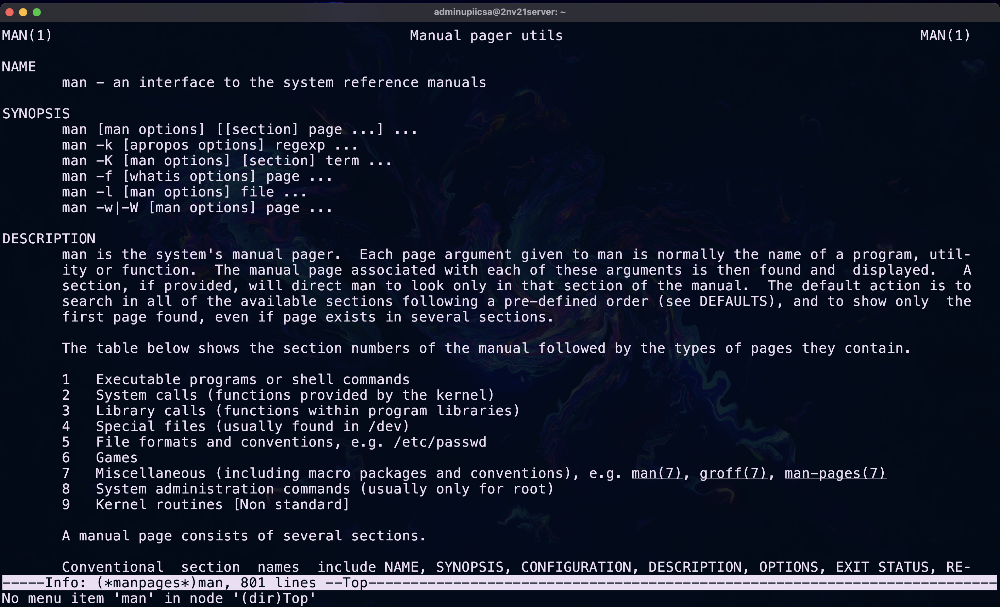
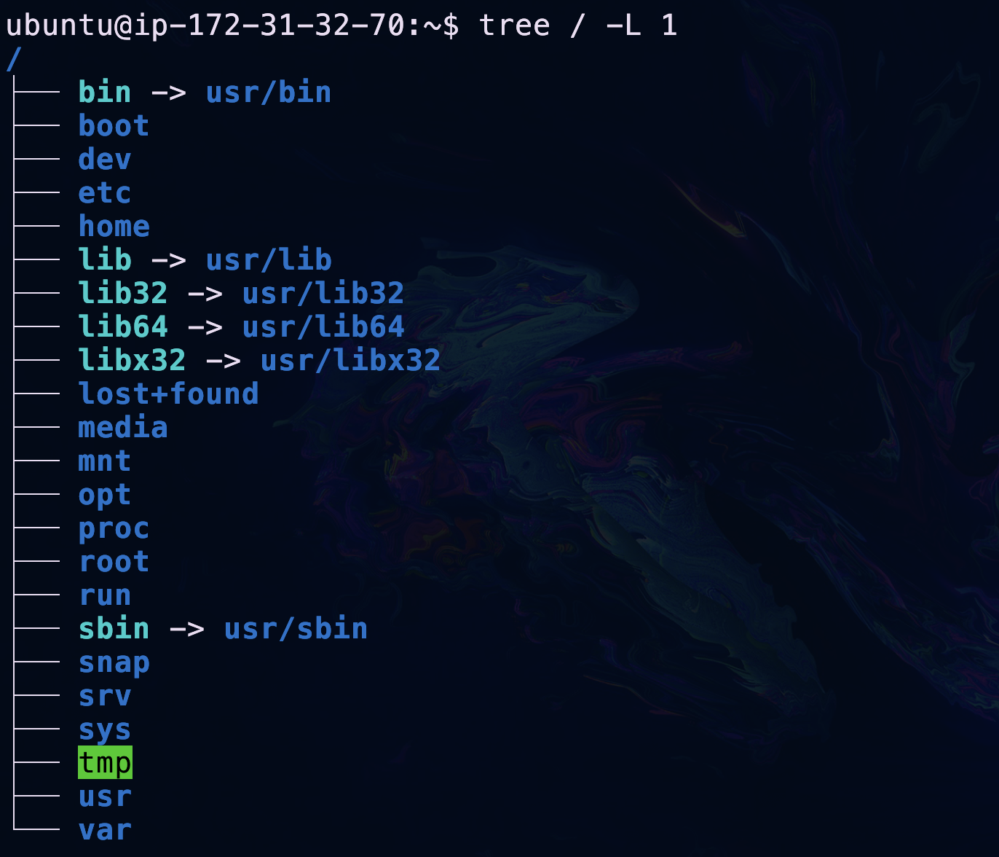
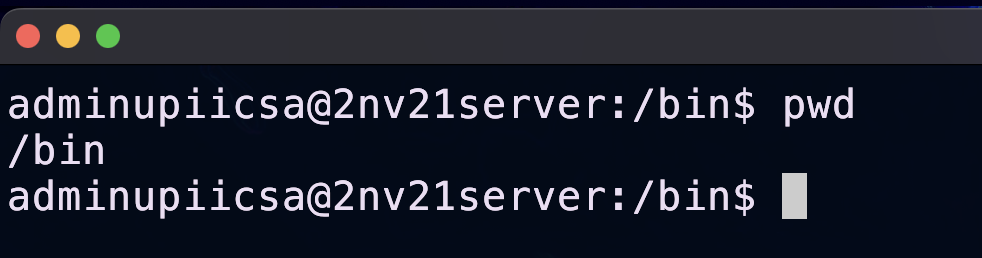
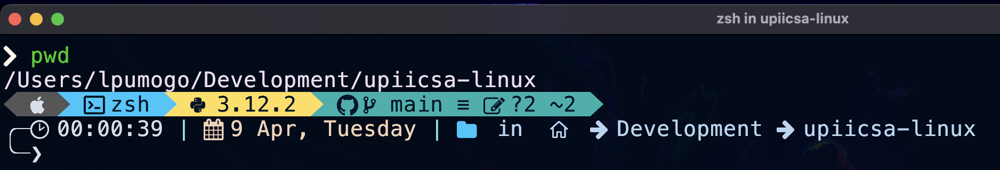
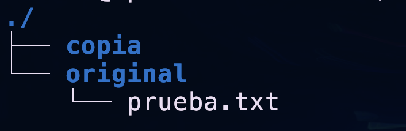
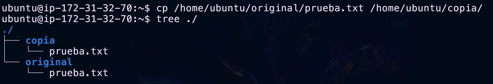
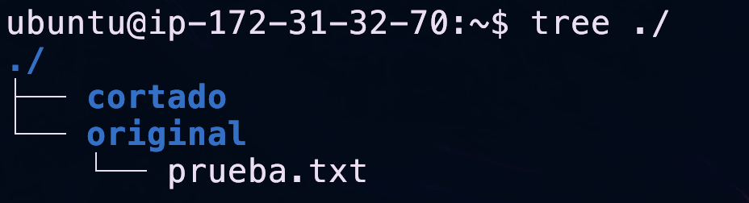
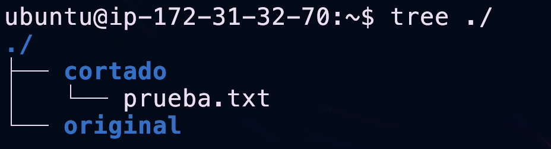

## Introducción 
La mayoría de los usuarios de computadoras fuera del mundo Linux y Unix no pasan mucho tiempo en la línea de comandos, pero como administrador de sistemas Linux, este es tu entorno de trabajo, por lo que debes tener habilidades en él.

Cuando utilizas un escritorio gráfico como Windows o macOS de Apple (o incluso las últimas versiones de Linux), existen "lugares" donde se almacenan tus cosas, "Imágenes", "Música", "Descargas", etc. 

Pero si tienes algún conocimiento técnico, te darás cuenta de que debajo de todo esto hay una "estructura de directorios".

!!! tip "Directorios y ficheros"
    Es común que en el vocabulario técnico nos refiramos a las **carpetas** como **directorios** y a los **archivos** como **ficheros**.

Ejemplos: 

- `C:\Users\Steve\Desktop` en Windows
- `/Users/Steve/Desktop` en macOS
- `/home/steve/Desktop`  en un sistema Linux.

De ahora en adelante, en el taller te indicaremos una serie de recursos en línea para un tema y luego te daremos un conjunto sencillo de tareas que debes realizar. Está perfectamente bien buscar en Google otros recursos en línea, consultar cualquier libro que tengas, preguntar a profesores, compañeros, etc. 

De hecho, un elemento fundamental del diseño de este taller es obligarte a hacer un poco de tu propia investigación. Incluso los administradores de sistemas más experimentados harán una búsqueda en línea para encontrar consejos sobre cómo usar los comandos, por lo que cuanto antes adquieras ese hábito, mejor.
***
## Tus tareas para este módulo
- Encontrar la documentación de los comandos que hemos usado hasta ahora. 
- Navegar entre directorios, crear directorios, listar contenidos mover y borrar archivos.  
***
## [RTFM](https://es.wikipedia.org/wiki/RTFM)

Este es un buen momento para mencionar que una de las muchas ventajas de Linux es que está diseñado para permitirte conocer el sistema y aprender a usarlo. 
La documentación está disponible en forma de manuales de texto, guías y foros. Es en ellos donde pasarás la mayor parte de tu tiempo durante este taller.

Mientras que los sistemas propietarios tienen alguna documentación gratuita, ves con mucha más frecuencia el uso de soporte técnico de pago para solucionar problemas o averiguar cómo se puede realizar una tarea en particular.

Aunque también puedes hacer esto con Linux (Canonical, RedHat y SuSE son ejemplos de empresas que ofrecen soporte de la misma manera), es muy probable que prefieras solucionarlo TÚ mismo. 

Lo cual nos lleva al famoso acrónimo [RTFM](https://es.wikipedia.org/wiki/RTFM). 

Leer el manual es lo primero que debes hacer cuando estás aprendiendo un comando. Vamos a repasar las muchas formas de obtener esa información, pero si al final de esa búsqueda necesitas más información, siempre puedes hacer una [pregunta bien redactada](https://opensource.com/life/16/10/how-ask-technical-questions) en foros y otras comunidades.

### man
Empezando con el comando `man`. 

Cada aplicación instalada viene con su propia página en este manual, por lo tanto es posible consultar la página de `pwd` y ver todos los detalles sobre la sintaxis, mediante el siguiente comando:
```BASH
man pwd
```

Te recomendamos probar los siguientes comandos:
```BASH
man cp
```

```BASH
man mv
```

```BASH
man grep
```

```BASH
man ls
```

```BASH
man man
```

Como verás, son excelentes para la sintaxis detallada de un comando, pero muchos son extremadamente concisos y para otros, la cantidad de detalles puede resultar algo abrumadora.

### tldr
¡Y es por eso que `tldr` es una herramienta tan poderosa! Puedes [instalarlo](https://tldr.sh/) fácilmente con los comandos:
```BASH
sudo apt install tldr -y
``` 
```BASH
tldr -u
```


Ejemplo de uso:

**Comando**
```BASH
tldr pwd
```
**Output**
```BASH
$ tldr pwd
pwd
Print name of current/working directory.More information: https://www.gnu.org/software/coreutils/pwd.

 - Print the current directory:
   pwd

 - Print the current directory, and resolve all symlinks (i.e. show the "physical" path):
   pwd -P
```

### apropos
Si conoces una palabra clave o alguna descripción de lo que se supone que debe hacer el comando, puede probar con `apropos` o `man -k` de esta manera:

**Comando**
```BASH
apropos "working directory"
```
**Output**
```BASH
$ apropos "working directory"
git-stash (1)        - Stash the changes in a dirty working directory away
pwd (1)              - print name of current/working directory
pwdx (1)             - report current working directory of a process

$ man -k "working directory"
git-stash (1)        - Stash the changes in a dirty working directory away
pwd (1)              - print name of current/working directory
pwdx (1)             - report current working directory of a process
```

### help
Pero pronto descubrirás que no todos los comandos tienen un manual que puedas leer con `man`. 
Los comandos sin página en `man` están contenidos dentro del propio shell y los llamamos comandos integrados ([built](https://www.gnu.org/software/bash/manual/html_node/Shell-Builtin-Commands.html)).

Hay algunos traslapes (es decir, comandos integrados que también tienen una página de manual), pero si `man` no funciona, usamos el comando `help` para mostrar información sobre ellos.

**Ejemplo:**

**Comando sin página de man**

```BASH
$ man export
No manual entry for export
```

**Help para ese mismo comando**
```BASH

$ help export
export: export [-fn] [name[=value] ...] or export -p
    Set export attribute for shell variables.

    Marks each NAME for automatic export to the environment of subsequently
    executed commands.  If VALUE is supplied, assign VALUE before exporting.

    Options:
      -f        refer to shell functions
      -n        remove the export property from each NAME
      -p        display a list of all exported variables and functions

    An argument of `--' disables further option processing.

    Exit Status:
    Returns success unless an invalid option is given or NAME is invalid.
```

La mejor manera de saber si un comando es un comando integrado es verificar su tipo mediante el comando `type`
**Ejemplo:**

**Comando integrado**
```BASH
$ type export
export is a shell builtin
```

**Comando NO integrado**
```BASH
$ type ping
ping is /usr/bin/ping
```

### info
Y por último, el comando `info` lee la documentación almacenada en formato [info](https://en.wikipedia.org/wiki/Info_(Unix)).

```BASH
info man
```



***

## Estructura de archivos

!!! tip "Todo es un fichero"
    En Linux y Unix **todo es un fichero**. 
    
    Los directorios son ficheros, los dispositivos son ficheros y los ficheros son ficheros.

??? note "Te sugerimos leer este artículo"
    Click [aquí](https://es.wikipedia.org/wiki/Sistema_de_archivos). 

Un sistema operativo tiene miles de archivos de información y programas, imagina el problema que sería encontrarlos, ejecutarlos o manipularlos sin un orden bien establecido.

Por suerte todos los SO tienen una organización conocida como estructura jerárquica, de tipo árbol.



El nivel más alto del sistema de ficheros es `/` o directorio raíz (tambie llamado root). 

Todos los demás ficheros y directorios están bajo el directorio raíz. 

Por ejemplo, `/home/enrique/calificaciones.txt` muestra la ruta completa al fichero `calificaciones.txt` que está en el directorio `enrique`, que a su vez está bajo el directorio `home`, que por su parte está bajo el directorio raíz (`/`).

!!! question "Actividad 1"
    Lee el manual: [`man hier`](https://help.ubuntu.com/kubuntu/desktopguide/es/directories-file-systems.html).

!!! question "Actividad 2"
    Responde lo siguiente:

    - ¿Qué directorio contiene las "aplicaciones binarias importantes"?
    - ¿Qué directorio contiene los ficheros de configuración?
    - ¿Qué directorio contiene "directorios personales para los diferentes usuarios"? 
    - ¿En qué directorio podemos encontrar "aplicaciones opcionales (de terceros)"?
    - ¿Cuál es el directorio personal del superusuario?
    - ¿En qué directorio encontramos archivos temporales (*temporary files*)?

### Directorio Personal

La conducta por defecto de los sistemas Linux, es que al ingresar te encuentres en tu directorio personal, contenido en `/home`, dicho directorio es el lugar destinado a almacenar tus archivos personales.

Normalmente el directorio se llama como el usuario. 

Ejemplo: 

- El usuario `enrique` tiene el directorio personal `/home/enrique`

!!! question "Actividad 3"
    Infiera cuál será el directorio personal de los usuarios:
        
    - `ramon`
    - `andy`
    - `jose`


### Tipos de rutas
Al trabajar con sistemas LINUX/UNIX cada fichero tendrá una **ubicación única**, es decir, si ya existe un archivo llamado `saludos.txt` en la carpeta `home/pruebas/` nadie puede crear un archivo con el mismo nombre en la misma carpeta.

Reflexione brevemente: ¿Será posible que se cree otro archivo llamado `saludos.txt` en una carpeta distinta?

La respuesta es sí, los siguientes ficheros pueden co-existir sin problemas: 

- `/home/pruebas/saludos.txt`
- `/home/enrique/saludos.txt`

Lo relevante aquí es saber cómo hace el SO para permitir que existan archivos con el mismo nombre pero en diferentes ubicaciones.

#### Ruta absoluta
Para linux cada fichero tiene una **ruta absoluta** asociada, que funge como la dirección exacta dentro del sistema de archivos donde algo está localizado. 

La ruta absoluta siempre nos dice en dónde se encuentra algo tomando como referencia el directorio `/` (root).

Ejemplos de rutas absolutas:

- `/etc/passwd`
- `/usr/bin/man`
- `/usr/bin/bash`

#### Ruta relativa
Una ruta "relativa" nos dice la ubicación de un fichero con respecto al directorio en el que nos encontramos. 
    
Suponga que existe la siguente ruta absoluta en su sistema:

- `/home/pruebas/saludos.txt`

Si usted ingresa como el usuario `pruebas` su directorio personal será `/home/pruebas`, por lo que si quiere acceder al fichero `saludos.txt` bastará con que se refiera a él como:

- `./saludos.txt`

Porque el SO interpreta `./` como el directorio actual, es decir: `/home/pruebas` y en consecuencia:
`/home/pruebas/saludos.txt` es equivalente a `./saludos.txt`.

### pwd
Los usuarios pueden navegar por los directorios que forman la estructura jerárquica (**siempre y cuando tengan permiso**).

Al navegar cambiaremos de directorio, el directorio en el que nos encontramos se llama **directorio actual de trabajo (working directory)**.

Simpre podemos conocer la **ruta absoluta** de nuestro directorio actual de trabajo mediante el comando:

```BASH
pwd
```

!!! question "Actividad 4"
     
    Obten tu directorio actual de trabajo.

### prompt

Se llama [prompt](https://es.wikipedia.org/wiki/Prompt) al carácter o conjunto de caracteres que se muestran en una línea de comandos para indicar que está a la espera de órdenes. Este puede variar dependiendo del intérprete de comandos y suele ser configurable.


??? note "Prompt y la ruta actual"
    Generalmente, su "[prompt](https://es.wikipedia.org/wiki/Prompt)" también está configurado para brindarle al menos parte de la información relativa a su ruta actual, por lo que si estoy en el directorio `/etc`, entonces el mensaje podría ser: `enrique@202.203.203.22:/etc$` o simplemente: `/etc: $`
    
    

### cd

El comando `cd` te permite navegar entre los diferentes directorios del sistema. 

Ejemplo:

El comando`cd /var/log` te llevará a la carpeta `/var/log`.

Intenta ejecutando:

```BASH
cd /tmp
```

Verifica tu ruta absoluta con `pwd`.

!!! tip "Vuelve a tu directorio HOME"
    El comando `cd` sin ninguna ruta específicada, por defecto te mandará a tu directorio personal también conocido como `~`. 

!!! tip "Directorio padre"
    Una ventaja de la existencia de las **rutas relativas** es el poder referirnos al directorio padre de cierto fichero con la notación `..`
    Por ejemplo, si usted se encuentra en la ruta `/var/log` puede regresar a `/var` mediante el comando:

    ```BASH
    cd ..
    ```

!!! question "Actividad 5"
    Ingrese a `/var/log/` luego ejecute estos comandos:
    ```BASH
    cd ..
    ```
    ```BASH
    cd ..
    ```
    Responda en qué directorio se encuentra al final. 


### ls

El comando `ls` (lista) le dará una lista de los ficheros y subcarpetas contenidos en su directorio actual de trabajo.

!!! note "Switches de `ls`" 
    Como muchos comandos de Linux, existen opciones (conocidas como "switches") para alterar el significado del comando o el formato de salida. 
    
    Pruebe con un `ls` simple, luego `ls -l -t` y luego intente con `ls -l -t -r -a`

!!! tip "Archivos ocultos"
    Por convención, los archivos con un carácter inicial "." se consideran ocultos y `ls`, y muchos otros comandos, los ignorarán. 
    
    El switch `-a` nos permite verlos.


??? note "Sintaxis de los modificadores/switches"
    Una nota sobre los modificadores: generalmente, la mayoría de los comandos de Linux aceptarán uno o más "parámetros" y uno o más "switches". 

    Entonces, cuando decimos `ls -l /var/log`, "`-l`" es un modificador para decir "formato largo" y "`/var/log`" es el "parámetro". 
    
    Muchos comandos aceptan una gran cantidad de modificadores y, por lo general, estos se pueden combinar (por lo tanto, de ahora en adelante, use `ls -ltra`, en lugar de `ls -l -t -r -a`.

!!! example "Identifique los directorios en su directorio personal" 
    Estando en el directrorio `/etc`, escriba: 
    ```BASH
    ls -ltra
    ``` 
    Observe la columna del extremo izquierdo; aquellas entradas con una "`d`" como primer carácter en la línea son directorios (carpetas) en lugar de archivos. 
    
    También pueden mostrarse en un color o fuente diferente; de ​​lo contrario, agregar el modificador :
    "`--color=auto`" debería hacer esto: 
    ```BASH
    ls -ltra --color=auto
    ```

### mkdir
Puedes crear un nuevo directorio con el comando: 
```BASH
mkdir <nombre_del_directorio>
```
!!! example "Cree su primer directorio"
    Ve a tu directorio de personal, escribe `pwd` para comprobar que está en el lugar correcto y luego crea un directorio, por ejemplo para crear uno llamado "primero", simplemente escriba:

    ```BASH
    mkdir primero
    ``` 
    Ahora use el comando `ls` para ver el resultado.
Puede crear aún más directorios, anidarlos dentro de directorios y luego navegar entre ellos con la ayuda del comando `cd`.

### touch
Puede crear un nuevo fichero vacío con el comando:
```BASH
touch <nombre_del_fichero>
``` 
??? note "Uso original de touch"
    El propósito original del comando `touch` no es crear ficheros, sino actualizar la hora y fecha de acceso y modificación del archivo específicado.
    
    Sin embargo, si se le pasa como parámetro un fichero que no existe, lo creará sin contenido. 

### cp
Es posible copiar ficheros o directorios mediante el comando:

```BASH
cp <elemento_que_desea_copiar> <ruta_que_alojará_el_contenido_copiado>
```

Ejemplo:

Suponga que existen los siguientes ficheros:

- `/home/ubuntu/original/prueba.txt`
- `/home/ubuntu/copia/`



Puedo generar el archivo `/home/ubuntu/copia/prueba.txt` mediante el comando:

```BASH
cp /home/ubuntu/original/prueba.txt /home/ubuntu/copia/
```




### mv
Es probable que se encuentre familiarizado con la operación "cortar", que consta de realizar una copia de algún elemento en otra ruta y posteriormente eliminar la versión original, esa operación se llama **mover** en Linux.

Es posible mover (cortar) ficheros o directorios mediante el comando:

```BASH
mv <elemento_que_desea_mover> <ruta_que_alojará_el_contenido>
```

Suponga que existen los siguientes ficheros:

- `/home/ubuntu/original/prueba.txt`
- `/home/ubuntu/cortado/`



Puedo mover el archivo `/home/ubuntu/original/prueba.txt` a `/home/ubuntu/cortado/prueba.txt` mediante el comando:

```BASH
mv /home/ubuntu/original/prueba.txt /home/ubuntu/cortado/prueba.txt
```



### rm

El comando `rm`nos permite eliminar archivos. 

```BASH
rm <archivo_que_deseas_eliminar>
```

Hay un comando que nos permite eliminar directorios **vacíos**.

```BASH
rmdir <directorio_que_deseas_eliminar>
```
Pero si el directorio tiene contenido, el comando `rmdir` dará error por lo que debemos pedir a `rm` que elimine de forma **recursiva**.

```BASH
rm -r
```

### cat
La forma más básica de leer el contenido de un fichero es mediante el comando:

```BASH
cat <fichero>
```

!!! example "Lee el contenido de `/etc/hosts`"
    ```BASH
    cat /etc/hosts
    ```

***

## Ejercicios recomendados
!!! question "Creación de directorios"
    Crea el siguiente árbol de carpetas: 
    `~/Tu_Nombre/Semana_01/Practica_01`

!!! question "Creación de ficheros"
    Crea los siguientes ficheros: 
    
    - `~/Tu_Nombre/Semana_01/Practica_01/Tu_nombre.txt`
    - `~/Tu_Nombre/Semana_01/Practica_01/Tu_comida_favorita.txt`

!!! question "Eliminación de ficheros"
    Elimina el fichero: 
    `~/Tu_Nombre/Semana_01/Practica_01/Tu_nombre.txt`

!!! question "Cambiar ficheros de carpeta"
    Cambia el fichero: 
    `~/Tu_Nombre/Semana_01/Practica_01/Tu_comida_favorita.txt`
    a la ruta 
    `~/Tu_Nombre/Semana_01/Practica_01/`

!!! question "Mover carpetas"
    Cambia la carpeta: 
    `~/Tu_Nombre/Semana_01/Practica_01/.txt`
    a la ruta 
    `~/Tu_Nombre/`

!!! question "Eliminar carpetas"
    Elimina la carpeta: 
    `~/.eliminame`

!!! example "Visualiza el contenido de un archivo"
    Ejecuta el comando 
    ```BASH
    cat ~/LEEME.txt
    ```

!!! question "Pregunta RETO 1"
    Accede a la plataforma [Overthewire](https://overthewire.org/wargames/bandit/bandit0.html), lee las instrucciones y conectate al nivel 0.

??? tip "1.- El contenido de este tip está oculto, se recomienda leerlo solo si NO se te ocurre ninguna solución."

    Usa el siguiente comando:
    ```BASH
    ssh bandit0@bandit.labs.overthewire.org -p 2220
    ```

!!! question "Pregunta RETO 2"
    Obten la contraseña del nivel 1 una vez estés conectado al nivel 0. 

!!! question "Pregunta RETO 3"
    Obten la contraseña del nivel 2 una vez estés conectado al nivel 1. 

??? tip "1.- El contenido de este tip está oculto, se recomienda leerlo solo si NO se te ocurre ninguna solución."

    El nombre del fichero "-" está causando problemas, prueba con la ruta absoluta o la ruta relativa. 

??? tip "2.- El contenido de este tip está oculto, se recomienda leerlo solo si NO se te ocurre ninguna solución."

    Prueba con el comando:

    ```BASH
    cat ./-
    ``` 

!!! question "Pregunta RETO 4"
    Obten la contraseña del nivel 3 una vez estés conectado al nivel 2.

??? tip "1.- El contenido de este tip está oculto, se recomienda leerlo solo si NO se te ocurre ninguna solución."

    Quizá lo siguiente te sea útil: 
    
    - [https://facilitarelsoftwarelibre.blogspot.com/2019/11/terminal-como-autocompletar-nombres-de.html](https://facilitarelsoftwarelibre.blogspot.com/2019/11/terminal-como-autocompletar-nombres-de.html)
    - [https://platzi.com/discusiones/1557-git-github/69589-por-favor-alguien-que-me-ayude-como-puede-ingresar-a-una-carpeta-que-contiene-un-nombre-con-espacios-por-ejemplo-la-carpeta-llamada-pr/](https://platzi.com/discusiones/1557-git-github/69589-por-favor-alguien-que-me-ayude-como-puede-ingresar-a-una-carpeta-que-contiene-un-nombre-con-espacios-por-ejemplo-la-carpeta-llamada-pr/)

!!! question "Pregunta RETO 3"
    Obten la contraseña del nivel 4 una vez estés conectado al nivel 3. 

??? tip "1.- El contenido de este tip está oculto, se recomienda leerlo solo si NO se te ocurre ninguna solución."

    No olvides la existencia de ficheros y directorios **ocultos**.

***

## Conclusión
Tener la capacidad de moverte con confianza por la estructura de directorios en la línea de comandos es importante, ¡así que no pienses que puedes pasarlo por alto! 

Sin embargo, estas habilidades son algo que utilizarás constantemente a lo largo de todas las lecciones del taller, así que no te desesperes si esto no "hace clic" de inmediato.
***
## Referencias
-  [linuxupskillchallenge](https://github.com/livialima/linuxupskillchallenge/tree/master)
-  [Difference between help, info and man command](https://unix.stackexchange.com/questions/19451/difference-between-help-info-and-man-command)
- [GNU Texinfo](https://www.gnu.org/software/texinfo/)
- [Explore the Linux file system](https://www.digitalocean.com/community/tutorials/how-to-use-cd-pwd-and-ls-to-explore-the-file-system-on-a-linux-server)
- [Linux File System](https://www.youtube.com/watch?v=2qQTXp4rBEE)
- [Simple Terminal Commands on Ubuntu](http://www.youtube.com/watch?v=CGBsurVdLGY)
- [Solaris Unix Commands](http://www.gsp.com/support/virtual/admin/unix/solaris/commands.html)
- [Sistemas de archivos](https://es.wikipedia.org/wiki/Sistema_de_archivos)
***
