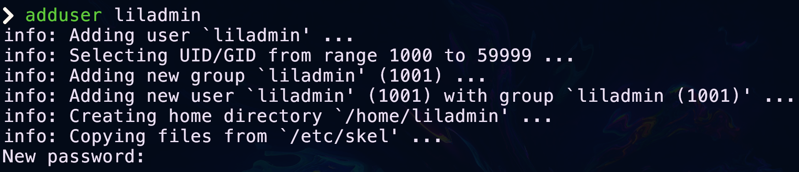
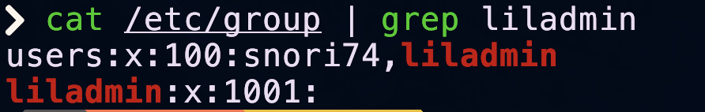
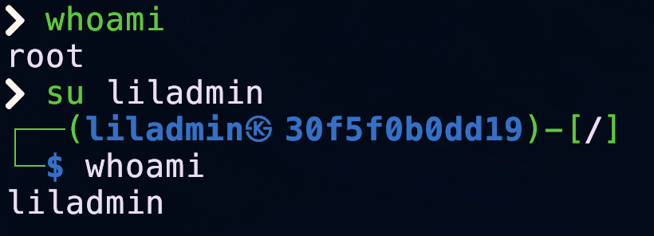
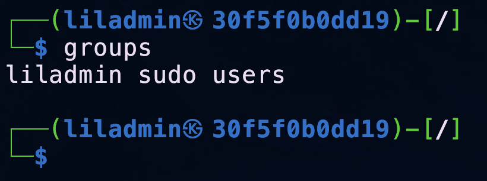
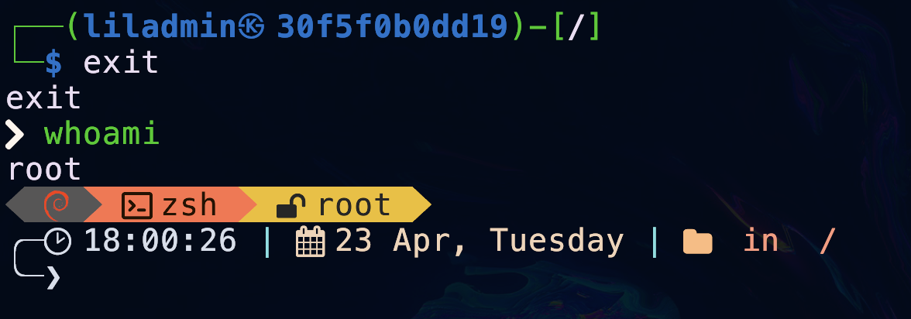
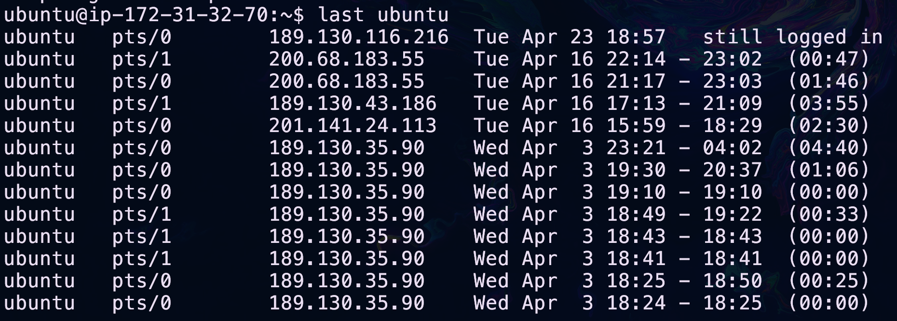

## Introducción

Es posible que hayas iniciado sesión como un usuario normal en tu servidor, pero probablemente sepas que root es el usuario avanzado en un sistema Linux. Esta cuenta administrativa o de “superusuario” es todopoderosa y un error tipográfico en un comando podría paralizar tu servidor. Como administrador de sistemas, normalmente trabajas en sistemas que son importantes y remotos, por lo que evitar este tipo de errores es una buena idea.

En la antigüedad, los administradores de sistemas solían iniciar sesión como root en los sistemas de producción, pero ahora es común desalentar o no permitir el inicio de sesión directamente por root y, en su lugar, otorgar a usuarios confiables específicos el permiso para ejecutar comandos *"solo de root"* a través del comando `sudo`.

## Tus tareas para este módulo

- Cambia la contraseña de tu usuario sudo
- Cambiar el nombre de host
- Cambiar la zona horaria

## Cambios Locales vs Cambios Globales

**Global**: Programas que cualquier usuario puede utilizar, utilizados en todo el sistema. 
Un cambio global afecta a todos los usuarios.

**Local o Por usuario**: Programas que ejecuta un usuario en particular, no disponibles para otros usuarios. Un cambio local afecta sólo a un usuario.

## ¿Quién eres y qué puedes hacer?

Hay 3 tipos de usuarios en un sistema Linux:

- `root`: el poderoso superusuario que puede ejecutar cualquier comando en cualquier nivel del sistema. Pueden realizar todos los cambios globales, así como cambios locales para cualquier usuario.

- `sudoers`: usuarios habituales a los que se les permite usar sudo, es decir, pueden ejecutar comandos en uno o más niveles del sistema, pueden realizar algunos o todos los cambios globales. Es común tener al menos un sudoer que tenga los mismos poderes que root, pero la cantidad de privilegios que tienen otros sudoers puede variar.

- `Usuarios regulares`: usuarios que pueden usar el sistema pero que solo pueden realizar cambios locales, es decir, que solo pueden manejar sus propios archivos/directorios y variables de entorno.

## Crear otro usuario con los poderes de root


### Creación de un nuevo usuario

Para crear a un nuevo usuario debemos ejecutar el siguiente comando:

```BASH
adduser <nombre del usuario>
```

Suponga que quiere crear al usuario `liladmin`

```BASH
adduser liladmin
```

El comando hará varias operaciones pero las más importantes son 

- Creará un grupo con el mísmo nombre que el usuario 

- Añadirá al usuario a ese grupo

- Creará un directorio personal 




Posteriormente el `prompt`se quedará esperando que le demos una nueva contraseña al usuario y luego pedirá que la confirmemos. 


A continuación nos pedirá los siguientes datos:

- Nombre completo del usuario
- Número de oficina 
- Teléfono de la empresa (extensión)
- Teléfono personal
- Otras notas


Una vez registremos esa información nos pedirá confirmarla. 


Finalmente nos saldrá una leyenda que nos dice que además del grupo homónimo al que añadió a nuestro usuario lo añadirá al grupo `users`.


Podemos corroborar la creación del grupo homónimo mediante el comando:

```BASH
cat /etc/group | grep liladmin
```



Para corroborar la existencia del usuario usamos el comando:

```BASH
cat /etc/passwd | grep liladmin
```


### Dar permisos de root a un usuario regular

!!! tip Importancia de los grupos
    Los grupos son entidades administrativas de una organización, sirve pensarlas como colecciones de individuos con ciertas características en común, por ejemplo, el personal contabilidad tiene acceso a ciertas carpetas y el personal de desarrollo a otras. Dichos accesos podrían configurarse usuario por usuario, pero sería más fácil determinar los accesos a un grupo y después solo añadir usuarios a dicho grupo para que hereden los accesos del grupo. 

La manera más sencilla de realizar esta operación es añadir al usuario a un grupo con privilegios `sudo`.

En muchas distribuciones existe un grupo con permisos de administrador llamado `sudo`, podemos verificar su existencia con:

```BASH
cat /etc/group | grep sudo
```


Si se lista el grupo quiere decir que el grupo existe en nuestra distribución y podemos continuar. 

Continuaremos añadiendo a nuestro usuario al grupo `sudo` con el comando `usermod`.

Este comando modifica a un usuario que se pase como parámetro. 
Le estamos indicaremos que queremos añadirlo a un grupo con el modificador `-a` y dicho modificador nos pide una lista de grupos indicada por `-G sudo`, te invitamos a que leas el detalle del comando usermod con:

```BASH
man usermod
```

```BASH
usermod -a -G sudo liladmin
```

Podemos cambiar de usuario con el comando:

```BASH
su liladmin
```


Ya estando en el nuevo usuario, podemos corroborar los grupos a los que pertenece con el comando: 

```BASH
groups
```


Nuestro usuario debería pertenecer a los dos grupos que se le asignaron en la creación (homónimo y users) y al grupo sudo que añadimos posteriormente.

Para salir del usuario nuevo usamos el comando:

```BASH
exit
```



## Cambiar de contraseña

Si estás utilizando una contraseña para iniciar sesión (en lugar de una clave pública), entonces es un buen momento para asegurarse de que sea muy segura y única, es decir, al menos 10 caracteres alfanuméricos, porque tu servidor está completamente expuesto a bots que intentarán continuamente entrar. Esto es especialmente importante si todavía estás usando root.

Utiliza el siguiente comando para cambiar tu contraseña:

```BASH
passwd
```

Para hacer esto, piensa en una contraseña nueva y segura, luego simplemente escribe `passwd`, presiona "`ENTER`" y proporciona tu contraseña actual cuando te la solicite, luego la nueva que has elegido, te pedirá confírmarla y luego ESCRÍBALA en algún lugar (te sugerimos usar algún [gestor de contraseñas](https://www.linkedin.com/pulse/la-importancia-de-utilizar-un-gestor-contraseñas-en-todas/)). Por supuesto, en un sistema de producción, las claves públicas y/o la autenticación de dos factores serían más apropiadas.


## Ejercicios recomendados

!!! question "Actividad 1"
    Prueba ejecutar este comando `cat /etc/shadow`. 
    
    ¿Puedes ver el contenido del archivo?

    Si no fuiste capaz de ver el contenido intenta con `sudo cat /etc/shadow`.

!!! tip "/etc/shadow"
    Este archivo es donde se guardan las **contraseñas hash**. Es un objetivo principal para los intrusos, que intentan apoderarse de él y utilizar software capaz de descifrar contraseñas. 
    
    Por lo tanto, es seguro asumir que no debería ser visible para usuarios no autorizados en el sistema.


!!! question "Actividad 2"
    Reinicia el servidor con el comando `reboot` si es necesario ejecutalo como superusuario. 

!!! question "Actividad 3"
    Una vez te vuelvas a conectar utiliza el comando `uptime` para confirmar que tu servidor realmente se reinició por completo.

!!! question "Actividad 4"
    Este es el output del comando `last ubuntu`
    

    ¿Cuándo fue el primer inicio de sesión?

    ¿Cuándo fue el último inicio de sesión?

!!! question "Actividad 5"
    Investiga el uso del comando:
    
    ```BASH
    lastb
    ```

    Ejecutalo en tu servidor.

!!! question "Actividad 6"
    Ejecuta el comando:
    
    ```BASH
    sudo -i
    ```

    ¿Qué hace?

!!! question "Actividad 7"
    Verifica las últimas veces que se uso el comando `sudo` con:

    ```BASH
    sudo journalctl -e /usr/bin/sudo
    ```

!!! question "Actividad 8"
    Valida tu hostname actual con:

    ```BASH
    hostnamectl
    ```

!!! question "Actividad 9"
    Actualiza tu hostname con:

    ```BASH
    sudo hostnamectl set-hostname mynuevohostname
    ```

    Comprueba que se haya actualizado correctamente.

??? note "Cambiar hostname en servidores en la nube"
    Para un servidor en la nube, es posible que el hostname cambie después de reiniciar. Para evitar esto, edita `/etc/cloud/cloud.cfg` y cambia la línea “`preserve_hostname`” para que tenga el valor `true`.

    Puedes hacerlo mediante el comando:

    ```BASH
    sudo sed -i 's/^preserve_hostname: false/preserve_hostname: true/' /etc/cloud/cloud.cfg

    ```

!!! question "Actividad 10"
    Verifica la configuración actual de zona horaria con:

    ```BASH
    timedatectl
    ```


!!! question "Actividad 11"
    Obten una lista de zonas horarias disponibles con:

    ```BASH
    timedatectl list-timezones
    ```

    Busca la más adecuada para ti y copia el nombre exacto, en mi caso `America/Mexico_City`.

!!! question "Actividad 12"
    Actualiza tu zonahoraria con el comando:
    
    ```BASH
    sudo timedatectl set-timezone America/Mexico_City
    ```

!!! question "Actividad 13"
    Corrobora que se haya actualizado tu zona horaria. 

## Conclusión

Como administrador de sistemas Linux, es posible que estes trabajando en sistemas de clientes que no configuraste desde el principio, y es probable que en muchos de ellos harán todo se ejecute como root por defecto. 

Debes saber trabajar de forma segura en dichos sistemas, y la  única protección que tienes es verificar tus comandos antes de presionar `ENTER`.

Por otro lado, para cualquier sistema en el que tengas control total, se recomienda configurar una cuenta "normal" para ti (y cualquier coadministrador) con permiso para ejecutar sudo. Si bien esto es estándar en Ubuntu, también es fácil de configurar con otras distribuciones de servidores populares como Debian, CentOS y RHEL.

Aun así, es importante tomar las precauciones necesarias antes de realizar cambios globales, para evitar bloquearse accidentalmente u otros problemas. Prácticas como utilizar un entorno de prueba, comprobar si hay errores de sintaxis y errores tipográficos y vigilar los archivos de registro acabarán convirtiéndose en algo natural.

## Referencias

[Cómo encontrar los últimos usuarios que iniciaron sesión en Linux](https://ostechnix.com/how-to-find-last-logged-in-users-in-linux/)
[Sudo en Ubuntu](https://help.ubuntu.com/community/RootSudo)
[Cómo utilizar “sudo”](https://www.howtoforge.com/sudo-beginners-guide/)
[Así se hace el descifrado de contraseñas](https://null-byte.wonderhowto.com/how-to/crack-shadow-hashes-after-getting-root-linux-system-0186386/)
[Inicio de sesión SSH sin contraseña](https://linuxize.com/post/how-to-setup-passwordless-ssh-login/)

