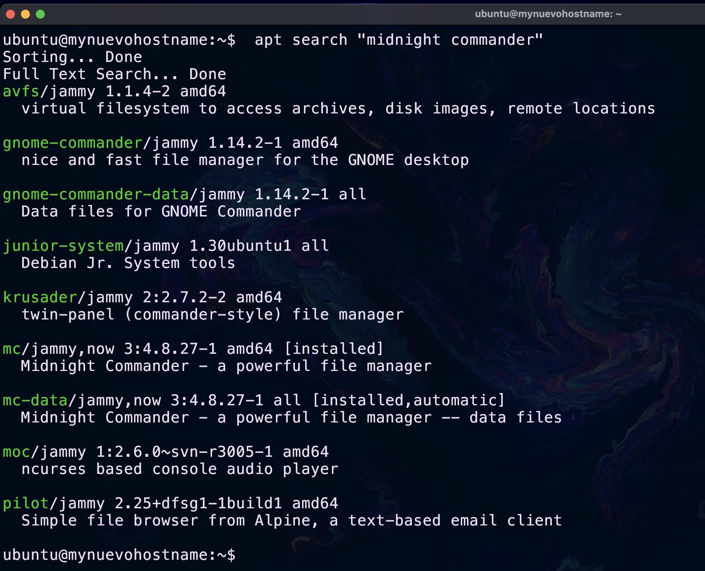
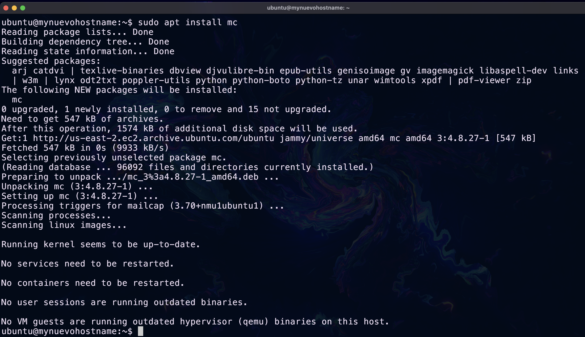
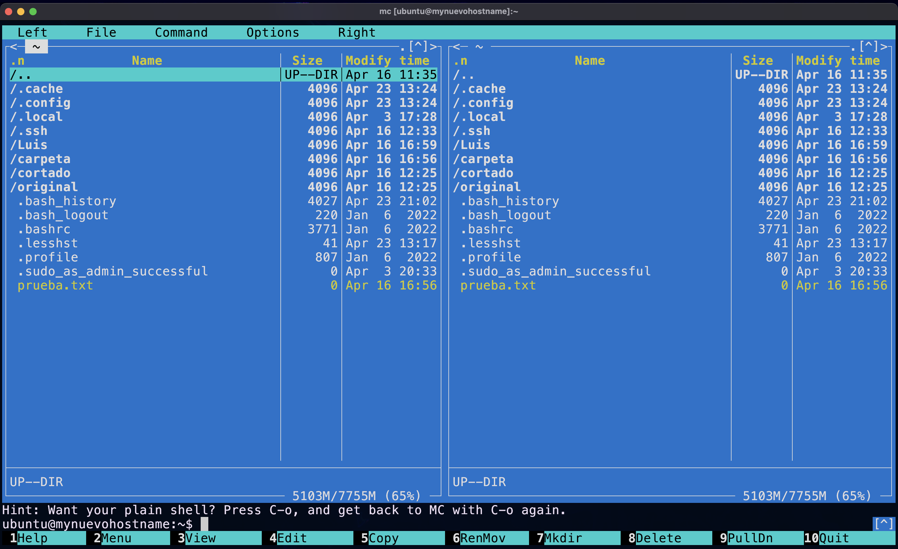

## Introducción

Como administrador de sistemas, una de tus tareas clave es instalar nuevo software según sea necesario. También necesitarás estar muy familiarizado con el diseño de los directorios estándar en un sistema Linux.

Practicarás en este módulo.


## Tus tareas para este módulo

- Buscar e instalar aplicaciones desde los repositorios en línea

### Buscar software en los repositorios estándar
Si has utilizado una “tienda de aplicaciones” de un teléfono inteligente, comprenderás inmediatamente la instalación normal del software Linux desde los repositorios estándar.

!!! tip "Repositorio"
    En el "argot" de Linux un **repositorio** es un servidor web que se encarga de almacenar programas para que el usuario pueda descargar e instalar en su distribución GNU/Linux.

!!! tip "Paquete"
    Un **paquete** se refiere a un archivo comprimido que contiene todos los archivos que vienen con un programa *(aplicación)* en particular.

??? note "Instalación de apps en linux"
    Para instalar aplicaciones en Linux de manera estándar, las buscamos en los **repositorios**. Desde estos repositorios, descargamos **paquetes** que nuestro sistema operativo gestiona. Luego, el sistema se encarga de descomprimir, instalar y colocar los archivos en las rutas adecuadas. Una vez completado este proceso, podemos hacer uso del programa simplemente escribiendo su nombre.

Siempre que sepamos cuál es el nombre o descripción de un paquete (programa), entonces podemos buscarlo con:

```BASH
apt search "<nombre del paquete o descripción>"
```

Supongamos que quieres buscar un programa (paquete) llamada "midnight commander", ejecutaríamos el siguiente comando: 

```BASH
apt search "midnight commander"
```



El comando anterior mostró una variedad de "paquetes" coincidentes, mismos que podremos instalar con el comando `apt install`. 


### Instalación de software mediante los repositorios estándar

Para instalar software basta con ejecutar el comando:

```BASH
sudo apt install <nombre del paquete>
```

De la lista de paquetes que encontramos mediante `apt search` instalaremos el que se llama `mc` (Midnight Commander) con el comando:

```BASH
sudo apt install mc
```



Una vez instalado podemos ejecutar nuestro nuevo programa con el comando `mc`.



### Borrar software instalado en tu SO

Para eliminar algún programa que hayas instalado mediante los repositorios estándar bastará con ejecutar el comando:

```BASH
sudo apt remove <nombre del paquete>
```

Para eliminar el programa `mc` que recién instalamos usariamos el comando:

```BASH
sudo apt remove mc
```

### Actualizar repositorios
El software que forma parte del ecosistema GNU/Linux está en constante movimiento, siempre hay programas nuevos y otros que dejan de recibir mantenimiento, en consecuencia, el nombre de paquetes y el repositorio donde están alojados puede cambiar.

La herramienta de gestión de paquetes `apt` tienen una base de datos que relaciona a todos los paquetes registrados con los repositorios donde los podemos encontrar, dicha base de datos se actualiza con cierta frecuencia, para que la herramienta actualice esa base de datos usamos el comando:

```BASH
sudo apt update
```

### Actualizar paquetes
El software que ya está instalado en nuestro sistema operativo puede recibir mejoras, parches, y nuevas funcionalidades a medida que se desarrolla. Estos cambios se manifiestan en forma de nuevas versiones de los paquetes que contienen las aplicaciones, lo que hace que la actualización de los paquetes sea crucial para mantener nuestro sistema operativo actualizado.

Para llevar a cabo la actualización del sistema operativo, utilizamos el siguiente comando:

```BASH
sudo apt upgrade
```

Este comando busca e instala las nuevas versiones de los paquetes disponibles para todas las aplicaciones instaladas en el sistema.


## Ejercicios recomendados

!!! question "Actividad 1"
    Hay un paquete relacionado con la descripción "Shows Linux System Information with Distribution Logo". 
    
    ¿Cómo averiguarías el nombre de dicho paquete?

!!! question "Actividad 2"
    Instala el paquete resultante de tu búsqueda de la actividad anterior.

!!! question "Actividad 3"
    Ejecuta el programa instalado en la actividad anterior. 

!!! question "Actividad 4"
    Instale lo siguiente:
    
    - `python3.11`
    - `cowsay`
    - `neovim`
    


