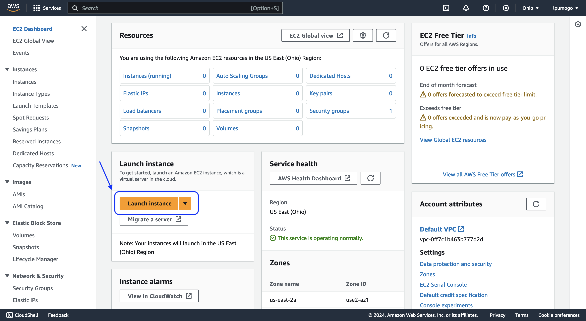
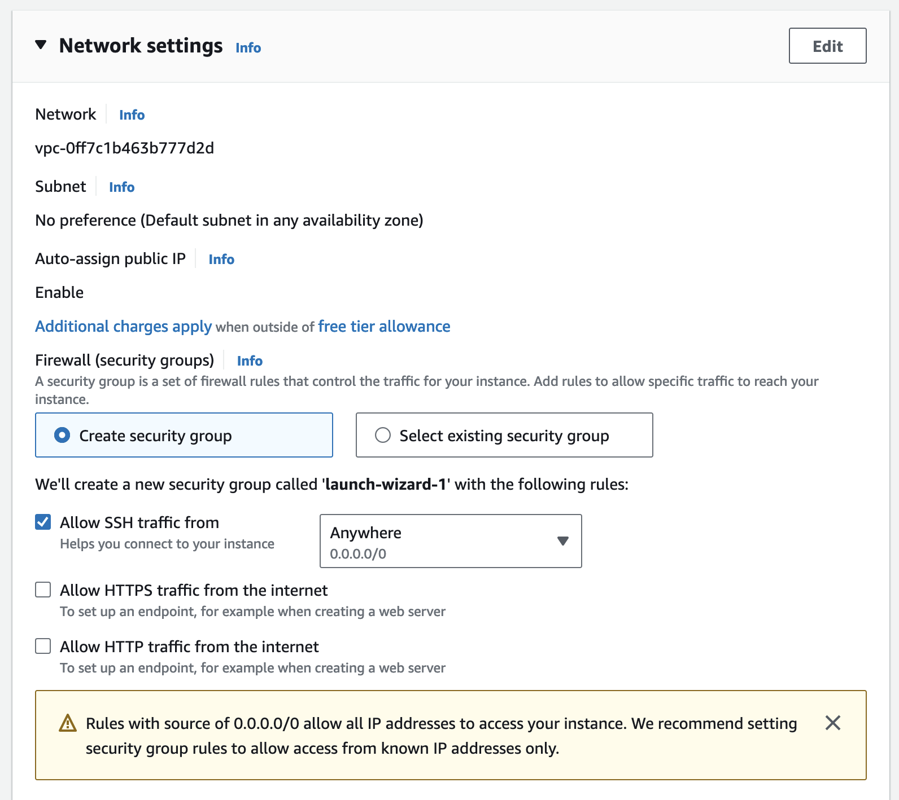

## Registro en AWS

Para registrarse, debes dirigirte al siguiente [sitio](https://portal.aws.amazon.com/billing/signup?nc2=h_ct&src=header_signup&redirect_url=https%3A%2F%2Faws.amazon.com%2Fregistration-confirmation#/start/email).

En él, debes proporcionar una dirección de correo electrónico y un nombre de usuario, como se muestra en la siguiente imagen:

Una vez hayas llenado la información solicitada, haz clic en el botón "Verify Email Address". Luego, accede a tu cuenta de correo electrónico, donde deberías encontrar un mensaje en tu bandeja de entrada con el asunto "AWS Email Verification". Dentro de este mensaje, encontrarás un código de 6 dígitos que será válido por 10 minutos. Introduce este código en el sitio web de AWS.

Una vez que la plataforma haya confirmado tu correo electrónico, te guiará a través de un proceso de registro en 5 pasos:

1. Crea una contraseña.
2. Proporciona tu información de contacto.
3. Información de pago.
4. Código de confirmación SMS.
5. Selecciona el tipo de plan de soporte técnico. Seleccionaremos "Basic Support" porque es gratuito.

Después de proporcionar la información solicitada, habrás creado tu cuenta de AWS y verás la siguiente pantalla:

Para ingresar, puedes hacer clic en el botón "Go to the AWS Management Console" o seguir este [enlace](https://signin.aws.amazon.com/signin?redirect_uri=https%3A%2F%2Fconsole.aws.amazon.com%2Fconsole%2Fhome%3FhashArgs%3D%2523%26isauthcode%3Dtrue%26nc2%3Dh_ct%26src%3Dheader-signin%26state%3DhashArgsFromTB_us-east-2_191a2fdcbb021b68&client_id=arn%3Aaws%3Asignin%3A%3A%3Aconsole%2Fcanvas&forceMobileApp=0&code_challenge=BjkNd54AofbS7VIXYxd4OjQ8vBCBIh3p2GE7XcI-fcc&code_challenge_method=SHA-256).

***

## Ingreso y configuración del servicio

La página de ingreso de AWS se ve de la siguiente manera:

Notarás que puedes ingresar de dos maneras. Por ahora, solo trabajaremos con la opción "Root User". Para ello, ingresa tu correo electrónico y haz clic en "next". En la siguiente ventana, ingresa tu contraseña y haz clic en "Sign in".

La ventana principal de la plataforma se ve de la siguiente manera: 

Para desplegar nuestro servidor debemos elegir el servicio correspondiente, para ello de click en el menú "Services" situado en la esquina superior izquierda junto al logo de AWS, ahí se desplegará una lista de categorías, busque la categoría "Compute" y de click en ella, las opciones se actualizarán y elegiremos el servicio "EC2" que es un VPS.

Una vez hemos elegido el servicio a desplegar (EC2) la plataforma nos mostrará un dashboard nuevo con muchas opciones que nos pueden resultar extrañas, lo único que buscamos en ese nuevo panel es un botón naranja que dice "Launch instance".

***

En cuanto demos click en dicho botón cargará una nueva página que nos pemitirá configurar los parámetros de nuestro servidor, las secciones son las siguientes:

- Name and tags
- Application and OS Images (Amazon Machine Image)
- Instance type
- Key pair (login)
- Network settings
- Configure storage  
- Advanced details

### Name and tags

En este apartado debemos escribir un nombre con el que podamos identificar a este VPS en particular, en mi caso use "Servidor Prueba UPIICSA".

***

### Application and OS Images (Amazon Machine Image)

!!! danger "Es importante el SO"
    Sistemas Operativos como Windows Server podrían implicar costes de licencias que debes contemplar. 

Aquí debemos seleccionar el sistema operativo que será instalado en nuestro servidor, para este taller usaremos "Ubuntu Server LTS", para seleccionarlo basta con dar click en el ícono de Ubuntu debajo de la pestaña "Quick Start" y podremos corroborar que sea nuestra imagen deseada en "Amazon Machine Image (AMI)".

Tu selección debería verse muy similar al contenido mostrado en la siguiente imagen:

***

### Instance type

En este apartado configuraremos los recursos de hardware con los que contará nuestro VPS, el tipo de máquina que AWS nos da para pruebas gratuitas (Free tier) es el **t2.micro**, se muy cuidadoso de elegir ese tipo de instancia. 

!!! danger "Cuidado con el Instance type"
    Es importante elegir una instancia que entre en el [free tier](https://aws.amazon.com/free/?all-free-tier.sort-by=item.additionalFields.SortRank&all-free-tier.sort-order=asc&awsf.Free%20Tier%20Types=*all&awsf.Free%20Tier%20Categories=*all) para no incurrir en cargos no deseados.
    
     AWS especifica que nos regala 750 horas (Aproximadamente un mes) de una instancia t2.micro con su respectiva IPv4, se cuidadoso de monitorear no sobrepasar las 750 horas para evitar cargos, que se harán en automático a tu tarjeta y serán dificiles de cancelar.  

***

### Key pair (login)

Da click en la opción "Create new key pair".

Se desplegará una nueva ventana en ella debemos establecer lo siguiente:

- "Key pair name", en mi caso id_rsa_UPIICSA_2NV20, tu la puedes llamar como prefieras pero te sugiero que le pongas el mismo nombre. 
- "Key pair type", selecciona "RSA"
- Private key file format, selecciona ".pem"

Cuando valides que tus datos son correctos, da click en "Create key pair".

En automático se cerrará la ventana emergente con la que estabas trabajando, se descargará un archivo con el nombre que acabas de escribir y la extensión .pem, además de que se seleccionará en automático la clave que acabas de crear como la clave de conexión a este VPS.

!!! note "Clave de ingreso"
    El archivo recien descargado es la clave mediante la cual seremos capaces de ingresar al servidor, es muy importante que NO la borres o pierdas. 

***

### Network settings

En esta sección recomendamos confirmar los parámetros que vienen por defecto sin modificar. 

Debemos verificar que los siguientes parámetros sí tengan estos valores:

- "Auto-assign public IP" debe estar en "Enable".
- "Firewall (security groups)" debe tener seleccionada la opción "Create security group".
- Tu security group debe permitir el tráfico SSH, para esto seleccionamos la casilla "Allow SSH traffic from" y por defecto tendrá el valor "Anywhere (0.0.0.0/0)".

!!! note "Permitir tráfico SSH"
    El último valor dice que permitiremos que se establezca una conexión remota mediante el protocolo SSH, es decir que ejecuten comandos en nuestro servidor mediante una terminal remota, la dirección 0.0.0.0/0 es un comodín equivalente a decir "cualquier IP", entonces cualquier IP puede tener una sesión remota con nuestro servidor, esto incluye tu universidad, tu casa,algún aeropuerto, alguna cafetería, la oficina de un hacker... 

    Podras notar que la última opción es un poco inquietante, por ello en entornos de producción reales en lugar de emplear un comodín se recomienda poner nuestra IP exacta, en este momento lo puedes dejar de esta manera, pero debes saber que existe el riesgo de ser hackeado.  

***

### Configure storage

Aquí asegurate que los parametros sean iguales a los de la imagen adjunta (deberían serlo porque son los parámetros por defecto).

***

### Advanced details

De momento no modificaremos nada en esta sección. 

***

### Summary
Una vez terminemos de ajustar nuestro VPS, verifiquemos que el recuadro de "Summary" tenga los siguientes datos:

Si todo está correcto, da click en el botón "Launch Instance".

Después de unos segundos deberías ver un mensaje que indique que tu instancia se inició de forma exitosa. 

Si llegaste hasta este punto de la guía sin tener problemas, felicidades configuraste tu primer VPS en AWS de forma exitosa, ya está disponible para que trabajes con él. 

En el [Módulo 2 - Conoce tu servidor](./Curso/Módulo_02_Conoce_tu_servidor.md) aprenderas como conectarte de manera remota para ocuparlo. 

Es muy importante que sepas como **detener tu servidor** porque solo puedes tenerlo prendido 750 horas sin generar cargos, tambien es importante que sepas como **eliminarlo** para que no te cobren por él una vez termines el taller, a continuación habrá dos secciones que te enseñarán a realizar estas dos acciones. 