## ¿Qué es Django?

Django es un `framework web` gratuito y de código abierto escrito en el lenguaje de programación Python. Lanzado por primera vez en 2005, Django ha estado en desarrollo continuo desde entonces y hoy en día impulsa muchos de los sitios web más grandes del mundo, incluyendo Instagram, Pinterest, Bitbucket y Disqus. Al mismo tiempo, es lo suficientemente flexible como para ser una opción popular para startups en etapas iniciales y proyectos personales.


## ¿Por qué Django?

Un "framework web" es una colección de herramientas que abstraen gran parte de la dificultad y repetición inherente al desarrollo web.
Por ejemplo, la mayoría de los sitios web necesitan la misma funcionalidad básica: la capacidad de conectarse a una base de datos, establecer rutas URL, mostrar contenido en una página, manejar la seguridad adecuadamente, y así sucesivamente. En lugar de recrear todo esto desde cero, los programadores a lo largo de los años han creado frameworks web en todos los principales lenguajes de programación: Django en Python, Rails en Ruby y Laravel en PHP, entre muchos otros.
Django heredó el enfoque de Python de "baterías incluidas" e incluye soporte listo para usar para tareas comunes en el desarrollo web, incluyendo:

- Autenticación de usuarios
- Tests
- Modelos de bases de datos, formularios, rutas URL y templates
- Interfaz de administración
- Actualizaciones de seguridad y rendimiento
- Soporte para múltiples motores de bases de datos

Este enfoque permite a los desarrolladores web centrarse en lo que hace única a una aplicación web en lugar de reinventar la rueda cada vez.

***

# Setup de un proyecto Django

## Creación de la carpeta del proyecto

```BASH
mkdir ~/Desktop/proyecto1Django
```


## Situarnos en el proyecto
```BASH
cd ~/Desktop/proyecto1Django
```


## Creación de un ambiente virtual

### MacOS
```BASH
python3 -m venv .venv
```

### Windows
```POWERSHELL
python -m venv .venv
```


```POWERSHELL
Set-ExecutionPolicy -ExecutionPolicy RemoteSigned -Scope CurrentUser
```


## Activar el ambiente virtual

### MacOS
```BASH
source .venv/bin/activate
```

### Windows
```POWERSHELL
.venv\Scripts\Activate.ps1
```


## Instalar Django
### Actualizar pip

```BASH
python -m pip install --upgrade pip
```


### Descargar Django

Puedes consultar las versiones desde el siguiente [sitio web](https://docs.djangoproject.com/en/5.0/releases/) 


Recomendamos que siempre instales la versión más reciente disponible en el momento de creación de tu proyecto.


Nosotros instalaremos la versión `5.0.6`

```BASH
python -m pip install django~=5.0.6
```


***

# Nuestro primer proyecto de Django

En la sección anterior instalamos todo lo necesario para trabajar con el framework, a partir de este momento haremos uso de sus herramientas para crear nuestro primer proyecto.

## Inicialización de proyecto

```BASH
django-admin startproject django_project .
```


Después de la ejecución de este comando nuestra carpeta de proyecto `proyecto1Django` tendrá la siguiente estructura de directorios:

```python
proyecto1Django/
    ├── django_project
    │   ├── __init__.py
    │   ├── asgi.py
    │   ├── settings.py
    │   ├── urls.py
    │   └── wsgi.py
    ├── manage.py
    └── .venv/
```

??? note "¿Qué son los ficheros dentro de `django_project/`?"
    - `__init__`.py indica que los archivos de la carpeta son parte de un paquete de Python. Sin este archivo, no podemos importar archivos desde otro directorio.
    - `asgi.py` permite ejecutar un [Asynchronous Server Gateway Interface](https://en.wikipedia.org/wiki/Asynchronous_Server_Gateway_Interface) (opcional)
    - `settings.py` controla la configuración general de nuestro proyecto Django
    - `urls.py` le dice a Django qué páginas crear en respuesta a un navegador o solicitud de URL
    - `wsgi.py` significa [Web Server Gateway Interface](https://es.wikipedia.org/wiki/WSGI) que ayuda a Django a servir a nuestras eventuales páginas web.

## Ejecución de servidor de desarrollo

Si la configuración ha funcionado bien hasta el momento, nuestro proyecto debería ser capaz de mostrar una página de prueba que Django instaló automáticamente, para verla bastará con ejecutar el **servidor de desarrollo** mediante el siguiente comando:

```BASH
python manage.py runserver
```


## Visitar página de proyecto

Ingresa a la siguiente URL: [http://127.0.0.1:8000/](http://127.0.0.1:8000/)

Deberás ver una pantalla como la siguiente:


Si pudiste ver esta pantalla quiere decir que la instalación se realizó correctamente y podrás continuar desarrollando tu aplicación.

??? note "Ciclo de Solicitud/Respuesta HTTP"
    El HTTP (Protocolo de transferencia de hipertexto) fue creado inicialmente por Tim Berners-Lee en 1989 y es la base de la World Wide Web. Un protocolo de red es un conjunto de reglas para formatear y procesar datos. Es como un lenguaje común para las computadoras que les permite comunicarse entre sí incluso si están ubicadas en lados opuestos de la tierra y tienen hardware y software muy diferentes.
    
    HTTP es un protocolo de solicitud-respuesta que funciona en un modelo informático cliente-servidor. Cada vez que visita una página web, el "cliente" (es decir, tu computadora) envía una "solicitud" inicial y un "servidor" envía una "respuesta". El cliente no tiene por qué ser un ordenador, también puede ser un teléfono móvil o cualquier dispositivo conectado a Internet. Pero el proceso es el mismo: un cliente envía una solicitud HTTP a una URL y un servidor devuelve una respuesta HTTP.
    
    En última instancia, todo lo que hace un framework web como Django es aceptar solicitudes HTTP a una URL determinada y devolver una respuesta HTTP que contiene la información necesaria para representar una página web. Eso es todo. Generalmente, este proceso implica identificar la URL adecuada, conectarse a una base de datos, agregar algo de lógica, aplicar estilo con HTML/CSS/JavaScript y luego devolver la respuesta HTTP. Eso es todo.

    ```python
    Flujo de un framework web

    Solicitud HTTP  -> URL -> Combina base de datos, lógica, estilos -> Respuesta HTTP 
    ```


??? note "Modelo-Vista-Controlador vs Modelo-Vista-Template"
    Con el tiempo, el patrón Modelo-Vista-Controlador (MVC) ha surgido como una forma popular de separar internamente los datos, la lógica y la visualización de una aplicación en componentes separados. Esto facilita que un desarrollador razone sobre el código. El patrón MVC se usa ampliamente entre los frameworks web, incluidos `Ruby on Rails (Ruby)`, `Spring (Java)`, `Laravel (PHP)`, `ASP.NET (C#)` y muchos otros.

    En el patrón MVC tradicional hay tres componentes principales:

    - Modelo: gestiona datos y lógica empresarial central.
    - Vista: presenta datos del modelo en un formato particular.
    - Controlador: acepta entradas del usuario y realiza lógica específica de la aplicación

    Django sólo sigue vagamente el enfoque MVC tradicional con su propia versión a menudo llamada `Modelo-Vista-Template` (MVT). Inicialmente, esto puede resultar confuso para los desarrolladores con experiencia previa en marcos web. En realidad, el enfoque de Django es en realidad un patrón de 4 partes que también incorpora la configuración de URL, por lo que algo como `MVTU` sería una descripción más precisa.

    El patrón Django MVT es el siguiente:

    - Modelo: gestiona datos y lógica empresarial central.
    - Vista: Describe qué datos se envían al usuario pero no su presentación.
    - Template: presenta los datos como HTML con CSS y JavaScript. 
    - URL: Patrones que permiten acceder a una vista y su template asociado.

    Esta interacción es fundamental para Django pero muy confusa para los recién llegados, así que tracemos el orden de un ciclo de solicitud/respuesta HTTP determinado. 
    
    Cuando escribe una URL, como https://djangoproject.com, lo primero que sucede dentro de nuestro proyecto Django es que se encuentra un patrón de URL (contenido en urls.py) que coincide. El patrón de URL está vinculado a una vista única (contenida en views.py) que combina los datos del modelo (almacenados en models.py) y el estilo de una plantilla (cualquier archivo que termine en .html). Luego, la vista devuelve una respuesta HTTP al usuario.

    ```python
    Ciclo Solicitud/Respuesta de Django

    Solicitud HTTP -> URL -> Vista -> Modelo y Template -> Respuesta HTTP
    ```

## Creación de una aplicación

Django utiliza el concepto de `proyectos` y `aplicaciones` para mantener el código limpio y legible. Un único proyecto Django puede contener varias aplicaciones. Cada aplicación controla una funcionalidad aislada. 

Por ejemplo, un sitio de comercio electrónico puede tener:

- aplicación para la autenticación de usuarios
- aplicación para pagos 
- aplicación para mostrar detalles de la lista de artículos 

Son tres aplicaciones distintas que viven dentro de un proyecto. 

Cómo y cuándo dividir la funcionalidad en aplicaciones es algo subjetivo, pero en general, cada aplicación debe tener una función clara.

Crearemos una aplicación llamada `portafolio` mediante el siguiente comando:

```BASH
python manage.py startapp portafolio
```


Notarás que se habrá creado un directorio homónimo a tu app con la siguiente estructura:

```python
├── portafolio
│   ├── __init__.py
│   ├── admin.py
│   ├── apps.py
│   ├── migrations
│   │   └── __init__.py
│   ├── models.py
│   ├── tests.py
│   └── views.py
```

??? note "¿Qué hacen los ficheros de mi nueva app?"
    - `admin.py` es un archivo de configuración para la aplicación integrada Django Admin
    - `apps.py` es un archivo de configuración para la propia aplicación
    - `migraciones/` realiza un seguimiento de cualquier cambio en nuestro archivo models.py para que permanezca sincronizado con nuestra base de datos
    - `models.py` es donde definimos nuestros modelos de base de datos que Django traduce automáticamente en tablas de bases de datos
    - `tests.py` es para pruebas específicas de aplicaciones
    - `views.py` es donde manejamos la lógica de solicitud/respuesta para nuestra aplicación web

## Añadir aplicación al proyecto

Aunque nuestra nueva aplicación existe dentro del proyecto, Django no la "sabe" hasta que la agregamos explícitamente al fichero `django_project/settings.py`. 

En tu editor de texto, abre el archivo y desplázate hacia abajo hasta que veas `INSTALLED_APPS`, donde habrá **seis** aplicaciones Django integradas. 


Agrega `"portafolio.apps.PortafolioConfig"` en la parte inferior.


!!! tip "Añadir más apps"
    Conforme tu aplicación crezca crearás y añadiras nuevas aplicaciones, el proceso es el mismo solo cambiará el nombre del texto, si la app fuera `cotizacion`, deberías añadir `cotizacion.apps.CotizacionConfig`.

??? note "¿Qué es portafolio.apps.PortafolioConfig?"
    Si abres el fichero `portafolio/apps.py`

    

    Verás una función llamada `PortafolioConfig`, esta función permite a Django identificar tu app. 

    

## Generar nuestra primera vista
Dirigete al fichero `portafolio/views.py`

Deberás ver un archivo casi vacío, salvo por el import.


Sustituye el contendio por este código:

```PYTHON
from django.http import HttpResponse

def homePageView(request):
    return HttpResponse("Hello, World!")
```

Quedando el fichero de la siguiente manera:


Básicamente, lo que hicimos fue hacer que cada que se llame a la función de vista `homePageView`, se devuelve el texto "Hello, World!".
 
Más específicamente, hemos importado el método integrado [HttpResponse](https://docs.djangoproject.com/en/4.0/ref/request-response/#django.http.HttpResponse)  para poder devolver un objeto de respuesta al usuario. 

Hemos creado una función llamada `homePageView` que acepta el objeto de `request` (solicitud) y devuelve una `HttpResponse` (respuesta) con la cadena "Hello, World!".

## Generar nuestra primera URL
1. Crea el fichero `portafolio/urls.py`
2. Dirigete al fichero `portafolio/urls.py`
3. Pega el siguiente código:

```python
from django.urls import path
from .views import homePageView

urlpatterns = [
    path("", homePageView, name="home"),
]
```
Tu archivo se verá de la siguiente manera:


En la línea superior importamos `path` desde Django para dar funcionalidad a nuestro patrón de URL y en la siguiente línea importamos nuestras vistas. 

Al referirnos al archivo `views.py` como `.views`, le estamos diciendo a Django que busque en el directorio actual un archivo `views.py` e importe la vista `homePageView` desde allí.

Nuestro patrón de URL tiene tres partes:

- una expresión regular de Python para la cadena vacía `" "` 
- una referencia a la vista llamada `homePageView`
- un [patrón opcional de URL con nombre](https://docs.djangoproject.com/en/4.0/topics/http/urls/#naming-url-patterns) denominado "`home`".

En otras palabras, si el usuario solicita la página de inicio representada por la cadena vacía "", Django debería usar la vista llamada homePageView.

## Añadir las urls de nuestra app al proyecto

De manera análoga a cuando añadimos la aplicación al proyecto, debemos añadir las URLs de esta app a la configuración del proyecto. 

Para ello dirígete al fichero `django_project/urls.py`


Se verá de la siguiente manera:


En la línea donde importa `path` escribe una coma y luego `include`.

Dentro del arreglo `urlpatterns` añade el siguiente patrón:

```python
path("", include("portafolio.urls")),
```

Quedando el archivo de la siguiente manera:


Si ejecutas el servidor de desarrollo con:

```BASH
python manage.py runserver
```

Y visitas la URL: [http://127.0.0.1:8000/](http://127.0.0.1:8000/) verás tu aplicación en acción. 


# Guardemos nuestro proyecto en un repositorio remoto

Primero al nivel de nuestra carpeta `proyecto1Django` crea un nuevo fichero llamado `.gitignore`.


Dentro de dicho fichero añade la siguientes líneas:

```GIT
.venv/
db.sqlite3
```

Ahora ejecutemos los siguientes comandos:

```BASH
git init
```

```BASH
git status
```


```BASH
git add -A
```

```BASH
git status
```


```BASH
git commit -m "Primer Commit"
```


```BASH
git status
```


Crea un repositorio en github


Usa los comandos que te sugiere inmediatamente después de crear el repositorio:


 
```BASH
git remote add origin https://github.com/lpumogo2024/proyectoDjango1.git
```
 
```BASH
git branch -M main
```

```BASH
git push -u origin main
```


Si recargas la página de github donde creaste el repositorio deberías ver tus archivos:


Si quisieras trabajar el proyecto en otro equipo deberías instalar todos los módulos usados en tu ambiente virtual mediante comandos de `pip install` si el proyecto es pequeño y se usan pocas librerías es posible, sin embargo, en un proyecto con muchas dependencias puede llevar a errores, por lo que se recomienda anotar todas las dependencias en un fichero llamado `requirements.txt`.

Muestra todas las dependencias con el comando:

```BASH
pip freeze
```


Podemos copiarlas y pegarlas en un fichero manualmente o emplear la redirección del `STDOUT` con el siguiente comando:

```BASH
pip freeze > requirements.txt
```

Se creará el fichero en automático con el contenido que muestra el comando `pip freeze`.

Ahora podemos seguir el flujo de guardar cambios incrementales en github con los siguientes comandos:

```BASH
git status
```

```BASH
git add -A
```

```BASH
git commit -m "Archivo requirements.txt"
```

```BASH
git push
```

```BASH
git status
```


# Configuremos nuestros templates

Cada framework web necesita una forma conveniente de generar archivos HTML y en Django el enfoque es utilizar "templates", es decir, archivos HTML individuales que se pueden vincular entre sí y que también incluyen lógica básica.

Nuestra primer vista muestra el mensaje: "Hello, World!". ¡Eso técnicamente funciona pero no escala bien! Un mejor enfoque es vincular una vista a un template, separando así la información contenida en cada una.

La primera consideración es dónde colocar los templates dentro de la estructura de un proyecto Django. 

## Estructura por defecto

Hay dos opciones. De forma predeterminada, el cargador de templates de Django buscará templates relacionadas dentro de cada aplicación. Sin embargo, la estructura es algo confusa: cada aplicación necesita un nuevo directorio de templates, otro directorio con el mismo nombre que la aplicación y luego el archivo de template.
Por lo tanto, en nuestra aplicación de portafolio, Django esperaría el siguiente diseño:

```python
└── portafolio
    ├── templates
        ├── portafolio
            ├── home.html
```

Esto significa que necesitaríamos crear un nuevo directorio de templates, un nuevo directorio con el nombre de la aplicación, y finalmente, nuestra plantilla, que es `home.html`.

¿Por qué este enfoque aparentemente repetitivo? ¡La respuesta corta es que el cargador de templates de Django quiere estar realmente seguro de encontrar la plantilla correcta! ¿Qué sucede si hay archivos home.html en dos aplicaciones independientes? Esta estructura garantiza que no existan tales conflictos.

Sin embargo, existe otro enfoque que consiste en crear un único directorio de plantillas a nivel de proyecto y colocar todas las plantillas allí. 

Al hacer un pequeño ajuste en nuestro archivo `django-project/settings.py`, podemos decirle a Django que también busque plantillas en este directorio. Ese es el enfoque que utilizaremos.

## Estructura recomendada
Primero crea un folder llamado `templates` dentro de `proyecto1Django` (ruta a la que nos referiremos como la ´raíz´ del proyecto), puedes usar el siguiente comando:

```BASH
mkdir templates
```

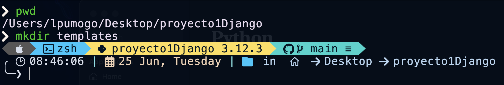


Tu explorador de archivos del editor de código debería tener los siguientes directorios y ficheros:

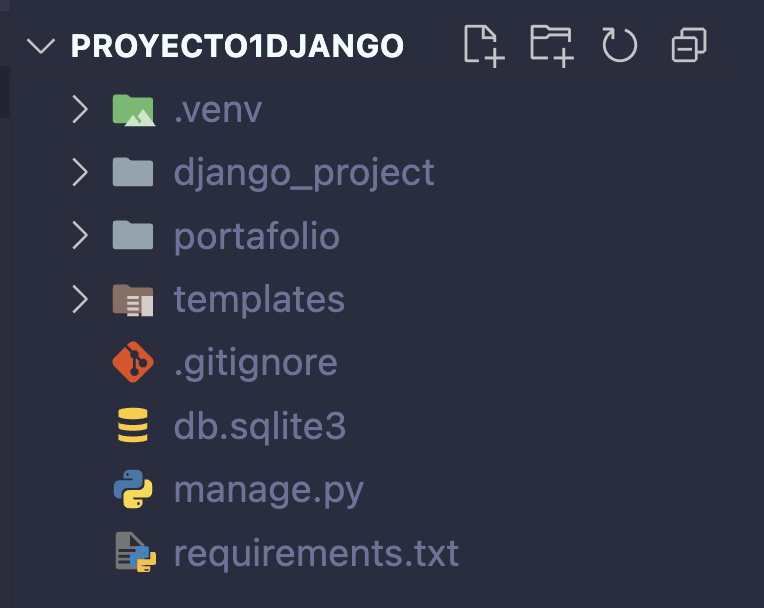

A continuación necesitamos actualizar nuestra configuración del proyecto para indicarle a Django la ubicación de nuestro nuevo directorio de `templates`. 

Dirigite al fichero `django_project/settings.py`

Ahí busca la configuración `TEMPLATES` que se debería ver de la siguiente manera:

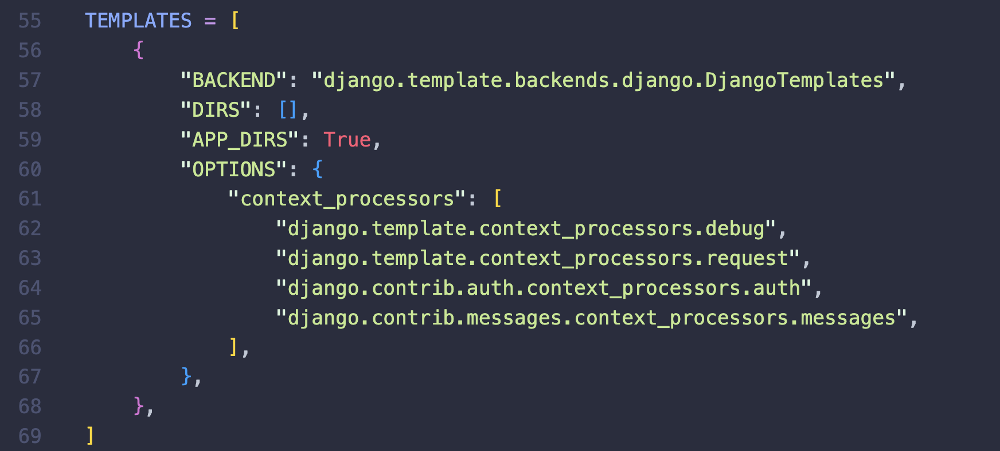

Deberás modificar la línea del diccionario `DIRS` para que tenga el siguiente contenido:

```python
"DIRS": [BASE_DIR / "templates"],
```

**Antes**


**Después**
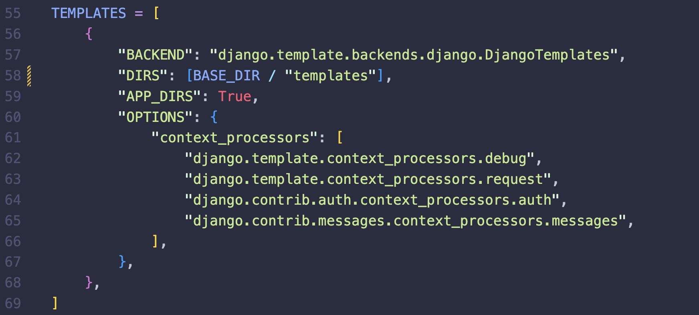

# Configuremos nuestros archivos estáticos

El directorio `templates` contendrá todos nuestros ficheros `.html`, sin embargo, necesitamos agregar algo de `CSS` a nuestro proyecto para mejorar el estilo.

`CSS`, `JavaScript` y las imágenes son una pieza central de cualquier aplicación web moderna y, dentro del mundo Django, se denominan "archivos estáticos". 

Django proporciona una tremenda flexibilidad en cuanto a cómo se utilizan estos archivos, pero esto puede generar mucha confusión al principio.

De forma predeterminada, Django buscará dentro de cada aplicación una carpeta llamada `static`. 

En otras palabras, una carpeta llamada `portafolio/static/`. Muy similar a cómo se tratan las templates.

A medida que los proyectos de Django crecen en complejidad con el tiempo y tienen múltiples aplicaciones, a menudo es más sencillo razonar sobre archivos estáticos si se almacenan en un único directorio a nivel de proyecto. Ése es el enfoque que adoptaremos aquí.

## Estructura recomendada
Primero crea un folder llamado `static` dentro de `proyecto1Django`, puedes usar el siguiente comando:

```BASH
mkdir static
```

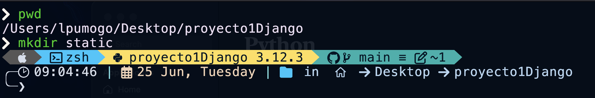


Tu explorador de archivos del editor de código debería tener los siguientes directorios y ficheros:

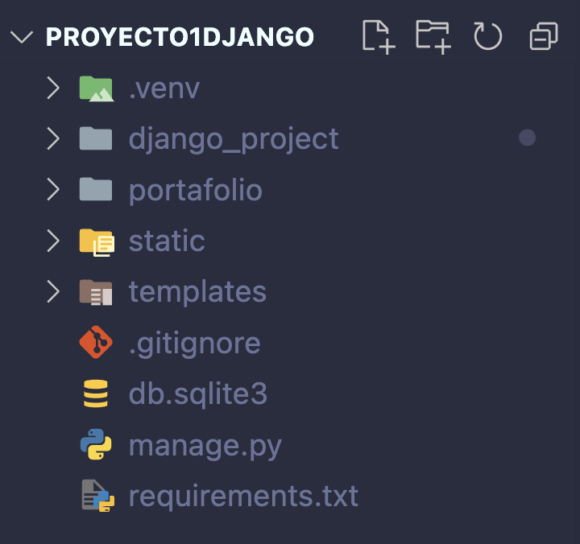

A continuación necesitamos actualizar nuestra configuración del proyecto para indicarle a Django la ubicación de nuestro nuevo directorio de `static`. 

Dirigite al fichero `django_project/settings.py`

Ahí busca la configuración `STATIC_URL` que se debería ver de la siguiente manera:

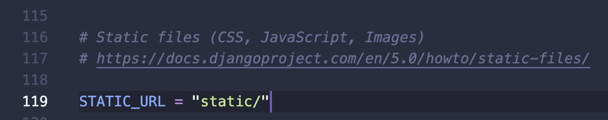

Deberás modificarla para que tenga el siguiente contenido:

```python
STATIC_URL = "/static/"
STATICFILES_DIRS = [BASE_DIR / "static"]
```

**Antes**


**Después**
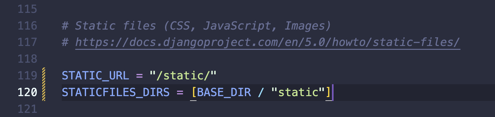

# Probemos nuestra configuración de templates-static

Para validar que nuestras configuraciones sean correctas crearemos dos ficheros, el primero será nuestra primer template a la que llamaremos `home.html` y se localizará dentro de nuestro directorio `templates`. 

El segundo será un fichero de estilos css llamado `styles.css` y se localizará dentro del directrio `static`

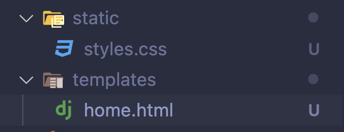

Añade el siguiente contenido a `templates/home.html`

```HTML


<!DOCTYPE html>
<html lang="en">
<head>
    <meta charset="UTF-8">
    <meta name="viewport" content="width=device-width, initial-scale=1.0">
    <link rel="stylesheet" href="">
    <title>Prueba</title>
</head>
<body>
    <div class="main-test">
        Hello, World!
    </div>
</body>
</html>
```

Añade el siguiente contenido a `static/styles.css`

```CSS
.main-test{
    background-color: red;
    color: white;
    padding: 10px;
    border-radius: 5px;
    margin: 10px;
}
```


Para que nuestra vista deje de retornar el mensaje que definimos inicialente y en su lugar retorne la plantilla que acabamos de crear modificaremos el fichero `portafolio/views.py` poniendo el siguiente contenido:

```python
from django.views.generic import TemplateView

class HomePageView(TemplateView): 
    template_name = "home.html"
```

**Antes**


**Después**
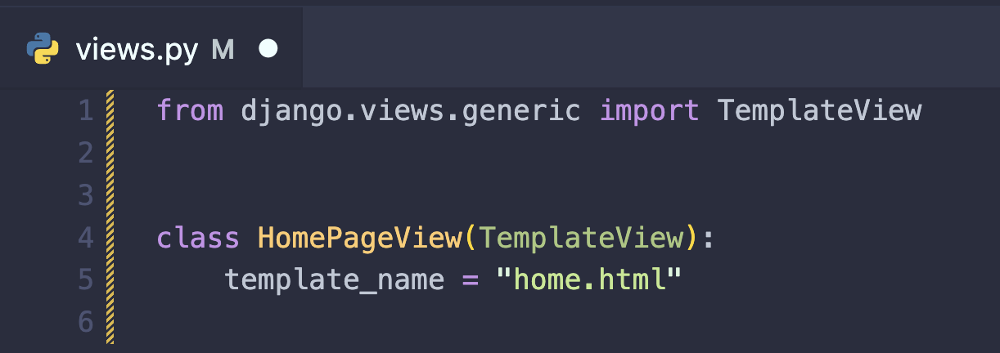

Finalmente modificaremos el fichero `portafolio/urls.py` poniendo el siguiente contenido:

```python
from django.urls import path 
from .views import HomePageView

urlpatterns = [
    path("", HomePageView.as_view(), name="home"),
]
```

**Antes**


**Después**
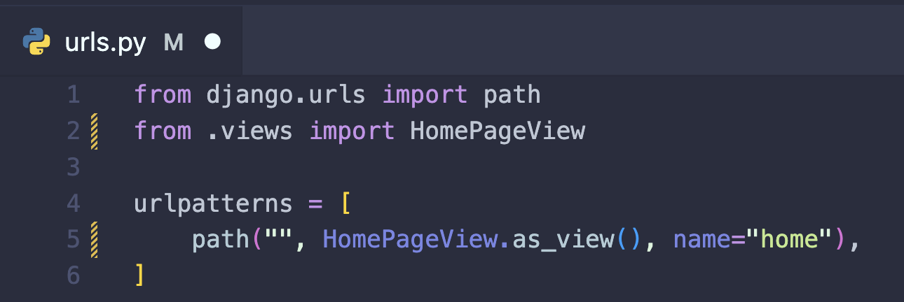

Ejecute el servidor de desarrollo mediante el comando:

```BASH
python manage.py runserver
```

E ingrese a [http://127.0.0.1:8000/](http://127.0.0.1:8000/)

Debería ser capaz de ver el siguiente contenido:

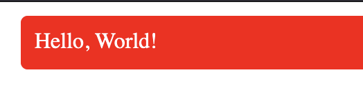

***

# CRUD
En informática, `CRUD` es el acrónimo de "Crear, Leer, Actualizar y Borrar" (del original en inglés: Create, Read, Update and Delete), que se usa para referirse a las funciones básicas en bases de datos o la capa de persistencia en un software.

En esta sección usaremos el proyecto que recién configuramos para generar un menú digital de restaurante partiendo del siguiente diagrama entidad-relación:


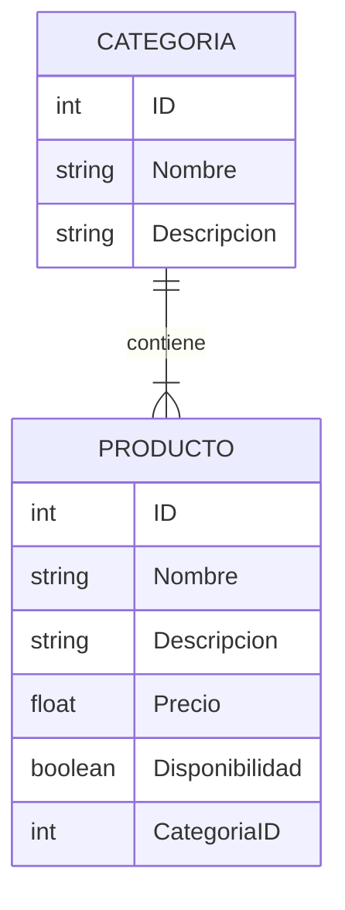

## Modelos

En Django, los modelos se utilizan para definir la estructura de la base de datos. Cada modelo representa una tabla en la base de datos y cada atributo del modelo representa una columna en dicha tabla. A continuación, explicaremos cómo definir un modelo llamado `Categoria`.

### Declaración del Modelo Categoría

Para definir un modelo en Django, debes crear una clase que herede de `models.Model`. Aquí tienes un ejemplo de cómo declarar un modelo `Categoria`:

```python
class Categoria(models.Model):
```

### Definición de Campos

Cada modelo debe tener campos definidos, que corresponden a los atributos de nuestro diagrama entidad-relación. En el modelo `Categoria`, definiremos dos campos:

```python
    nombre = models.CharField(max_length=50)
    descripcion = models.TextField()
```

- `nombre`: Este es un `CharField`, que se utiliza para almacenar texto corto. El argumento `max_length=50` establece la longitud máxima permitida para este campo en 50 caracteres.
  
- `descripcion`: Este es un `TextField`, que se utiliza para almacenar texto más largo sin una longitud máxima específica.

### Método `__str__`

Es una buena práctica definir el método `__str__` en tus modelos. Este método determina cómo se representará el objeto del modelo como una cadena. Esto es especialmente útil para la representación de los objetos en el panel de administración de Django y en otros contextos donde los objetos se convierten en cadenas.

```python
    def __str__(self):
        return self.nombre
```

En este caso, el método `__str__` devuelve el valor del campo `nombre`. Esto significa que cuando se imprima o se muestre un objeto `Categoria`, se verá como el valor de su campo `nombre`.

### Declaración Completa del Modelo

Aquí está la declaración completa del modelo `Categoria`:

```python
class Categoria(models.Model):
    nombre = models.CharField(max_length=50)
    descripcion = models.TextField()

    def __str__(self):
        return self.nombre
```

¡Por supuesto! Vamos a introducir el siguiente modelo, `Producto`, y explicaremos los detalles relevantes de su declaración.

### Declaración del Modelo Producto

Aquí está la declaración del modelo `Producto`:

```python
class Producto(models.Model):
    nombre = models.CharField(max_length=50)
    descripcion = models.TextField()
    precio = models.DecimalField(max_digits=5, decimal_places=2)
    disponibilidad = models.BooleanField(default=True)
    categoria = models.ForeignKey(Categoria, on_delete=models.CASCADE)

    def __str__(self):
        return self.nombre
```

### Detalles Relevantes

- `nombre`: Este es un `CharField` con una longitud máxima de 50 caracteres, utilizado para almacenar el nombre del producto.

- `descripcion`: Este es un `TextField`, utilizado para almacenar una descripción detallada del producto.

- `precio`: Este es un `DecimalField`, que se utiliza para almacenar valores decimales. El argumento `max_digits=5` especifica el número total de dígitos permitidos en el número, mientras que `decimal_places=2` especifica cuántos de esos dígitos se encuentran después del punto decimal. Esto es útil para almacenar precios.

- `disponibilidad`: Este es un `BooleanField`, que se utiliza para almacenar valores de verdadero o falso. El argumento `default=True` establece que el valor predeterminado es `True`, lo que indica que el producto está disponible por defecto.

- `categoria`: Este es un `ForeignKey` que crea una relación muchos a uno con el modelo `Categoria`. El argumento `on_delete=models.CASCADE` especifica que si la categoría asociada se elimina, todos los productos asociados con esa categoría también se eliminarán. Esta relación permite que cada producto esté asociado con una categoría específica.

## Implementación en proyecto

Para implementar los modelos en el proyecto deberás dirigirte al fichero `portafolio/models.py` y dejar su contenido de la siguiente manera:

```python
from django.db import models


class Categoria(models.Model):
    nombre = models.CharField(max_length=50)
    descripcion = models.TextField()

    def __str__(self):
        return self.nombre


class Producto(models.Model):
    nombre = models.CharField(max_length=50)
    descripcion = models.TextField()
    precio = models.DecimalField(max_digits=5, decimal_places=2)
    disponibilidad = models.BooleanField(default=True)
    categoria = models.ForeignKey(Categoria, on_delete=models.CASCADE)

    def __str__(self):
        return self.nombre

```

### Creación y Aplicación de Migraciones

Después de definir tus modelos en Django, debes crear y aplicar las migraciones para actualizar tu base de datos con las nuevas estructuras de las tablas. Aquí están los pasos a seguir:

### Paso 1: Crear Migraciones

El primer comando que debes ejecutar es `makemigrations`. Este comando analiza tus modelos y crea los archivos de migración necesarios para reflejar los cambios en la base de datos.

```bash
python manage.py makemigrations
```

Al ejecutar este comando, Django generará un archivo de migración en el directorio `migrations` de tu aplicación. Este archivo contiene las instrucciones para crear las nuevas tablas y campos en la base de datos.

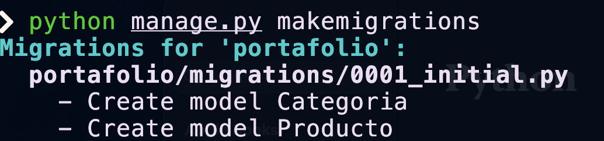

### Paso 2: Aplicar Migraciones

Una vez que las migraciones han sido creadas, necesitas aplicarlas a la base de datos usando el comando `migrate`. Este comando ejecuta las instrucciones contenidas en los archivos de migración para actualizar la estructura de la base de datos.

```bash
python manage.py migrate
```

Al ejecutar este comando, Django aplicará todas las migraciones pendientes y actualizará tu base de datos con las nuevas tablas y campos definidos en tus modelos.

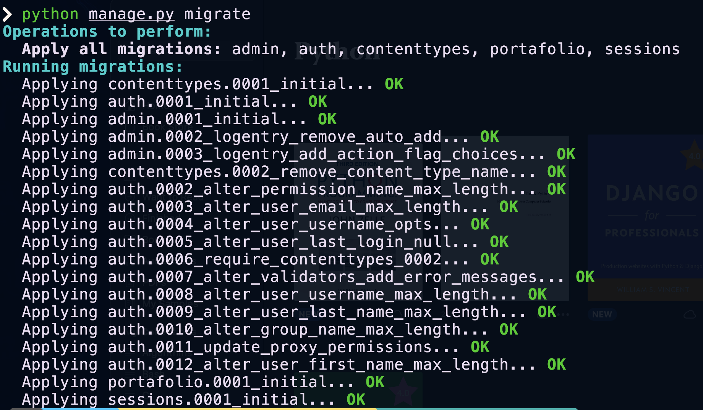

### Resumen

1. **Crear Migraciones**:
    ```bash
    python manage.py makemigrations
    ```

2. **Aplicar Migraciones**:
    ```bash
    python manage.py migrate
    ```

Estos comandos son esenciales para que los cambios en tus modelos se reflejen en la base de datos. Asegúrate de ejecutarlos en este orden cada vez que hagas cambios en tus modelos.

## Vistas

En Django existen diferentes tipos de vistas, originalmente solo existían las vistas basadas en funciones, sin embargo, los desarrolladores pronto notaron que las acciones de un `CRUD` son en escencia identicas siempre (lista todos los registros de una tabla, crea un nuevo registro de cierta tabla, elimina un registro, etc.) para ello desarrollaron `Vistas basadas en Clases (Class-Based Views)` que nos permiten heredar los casos de uso comúnes para no perder tiempo volviendo a escribir funciones usuales una y otra vez. 

Para desarrollar nuestro CRUD haremos uso de varias `Class-Based Views` y veremos lo fácil que es implementarlas en Django.

Para comenzar a generar el código de nuestras vistas edita el fichero `portafolio/views.py`, en él será necesario que en la parte superior escribas el siguiente código que nos permite importar modelos y las clases de las que heredaremos:

```python
from .models import Categoria, Producto

from django.views.generic import (
    CreateView,
    ListView,
    UpdateView,
    DeleteView,
)


```

### Vista de Creación
Comencemos con la vista que nos permite crear registros de `Categoria`:

```python

class CategoriaCreateView(CreateView):
    model = Categoria
    template_name = "categoria_create.html"
    fields = [
        "nombre",
        "descripcion",
    ]
    success_url = "/"

```

Debemos crear el fichero `templates/categoria_create.html` vinculado a esta vista.

La vista que nos permite crear registros de `Producto` es análoga:

```python
class ProductoCreateView(CreateView):
    model = Producto
    template_name = "producto_create.html"
    fields = [
        "nombre",
        "descripcion",
        "precio",
        "disponibilidad",
        "categoria",
    ]
    success_url = "/"
```

Debemos crear el fichero `templates/producto_create.html` vinculado a esta vista.

### Vista de Lectura

Para listar todos los registros de `Categoria` usaremos esta vista:

```python
class CategoriaListView(ListView):
    model = Categoria
    template_name = "categoria_list.html"
    context_object_name = "categorias"
```

Debemos crear el fichero `templates/categoria_list.html` vinculado a esta vista.

Para listar todos los registros de `Producto` usaremos:

```python
class ProductoListView(ListView):
    model = Producto
    template_name = "producto_list.html"
    context_object_name = "productos"
```
Debemos crear el fichero `templates/producto_list.html` vinculado a esta vista.

### Vista de Actualización

Para actualizar algún registro de `Categoria` usaremos:

```python
class CategoriaUpdateView(UpdateView):
    model = Categoria
    template_name = "categoria_update.html"
    fields = [
        "nombre",
        "descripcion",
    ]
    success_url = "/"
```

Debemos crear el fichero `templates/categoria_update.html` vinculado a esta vista.

Para actualizar algún registro de `Producto` usaremos:

```python
class ProductoUpdateView(UpdateView):
    model = Producto
    template_name = "producto_update.html"
    fields = [
        "nombre",
        "descripcion",
        "precio",
        "disponibilidad",
        "categoria",
    ]
    success_url = "/"
```

Debemos crear el fichero `templates/producto_update.html` vinculado a esta vista.

### Vista de Borrado

Para borrar algún registro de `Categoria` usaremos:

```python
class CategoriaDeleteView(DeleteView):
    model = Categoria
    template_name = "categoria_delete.html"
    success_url = "/"
```

Debemos crear el fichero `templates/categoria_delete.html` vinculado a esta vista.

Para borrar algún registro de `Producto` usaremos:

```python
class ProductoDeleteView(DeleteView):
    model = Producto
    template_name = "producto_delete.html"
    success_url = "/"
```

Debemos crear el fichero `templates/producto_delete.html` vinculado a esta vista.

### Contenido del fichero views.py

```python
from django.views.generic import TemplateView

from .models import Categoria, Producto

from django.views.generic import (
    CreateView,
    ListView,
    UpdateView,
    DeleteView,
)


class HomePageView(TemplateView):
    template_name = "home.html"


class CategoriaCreateView(CreateView):
    model = Categoria
    template_name = "categoria_create.html"
    fields = [
        "nombre",
        "descripcion",
    ]
    success_url = "/"


class CategoriaListView(ListView):
    model = Categoria
    template_name = "categoria_list.html"
    context_object_name = "categorias"


class CategoriaUpdateView(UpdateView):
    model = Categoria
    template_name = "categoria_update.html"
    fields = [
        "nombre",
        "descripcion",
    ]
    success_url = "/"


class CategoriaDeleteView(DeleteView):
    model = Categoria
    template_name = "categoria_delete.html"
    success_url = "/"


class ProductoCreateView(CreateView):
    model = Producto
    template_name = "producto_create.html"
    fields = [
        "nombre",
        "descripcion",
        "precio",
        "disponibilidad",
        "categoria",
    ]
    success_url = "/"


class ProductoListView(ListView):
    model = Producto
    template_name = "producto_list.html"
    context_object_name = "productos"


class ProductoUpdateView(UpdateView):
    model = Producto
    template_name = "producto_update.html"
    fields = [
        "nombre",
        "descripcion",
        "precio",
        "disponibilidad",
        "categoria",
    ]
    success_url = "/"


class ProductoDeleteView(DeleteView):
    model = Producto
    template_name = "producto_delete.html"
    success_url = "/"

```

## Templates
### Creación de categoría

```html


<!DOCTYPE html>
<html> 
    <head> 
        <title>Crear Categoría</title> 
        <link rel="stylesheet" href=""> 
    </head> 
    <body> 
        <div class="content section"> 
            <div class="block">
                <h2>Crear Categoría</h2>
                <form method="post">
                    
                    {{ form.as_p }}
                    <button type="submit">Crear</button>
                </form>
            </div> 
        </div> 
    </body> 
</html>
```

### Listado de categorías

```html


<!DOCTYPE html>
<html> 
    <head> 
        <title>Listado de Categorias</title> 
        <link rel="stylesheet" href=""> 
    </head> 
    <body> 
        <div class="content section"> 
            <div class="block">
                <h2>Listado de Categorias</h2>

                <a href="">Crear Membresia</a>

                
                    <ul>
                        <li>
                            {{ categoria }}
                        </li>
                    </ul>
                
                    <ul>
                        <li>No hay categorias disponibles.</li>
                    </ul>
                
            </div>
        </div> 
    </body> 
</html>
```

### Actualización de categorias

```html


<!DOCTYPE html>
<html> 
    <head> 
        <title>Actualizar Categoría</title> 
        <link rel="stylesheet" href=""> 
    </head> 
    <body> 
        <div class="content section"> 
            <div class="block">
                <h2>Actualizar Categoría</h2>
                <form method="post">
                    
                    {{ form.as_p }}
                    <button type="submit">Actualizar</button>
                </form>
            </div> 
        </div> 
    </body> 
</html>
```

### Borrado de categorias

```html


<!DOCTYPE html>
<html> 
    <head> 
        <title>Eliminar Categoria</title> 
        <link rel="stylesheet" href=""> 
    </head> 
    <body> 
        <div class="content section"> 
            <div class="block">
                <h2>Eliminar Categoria</h2>
                <p>¿Estás seguro de que quieres eliminar la categoria "{{ object.nombre }}"?</p>
                <form method="post">
                    
                    <button type="submit">Eliminar</button>
                </form>
            </div>
        </div> 
    </body> 
</html>
```

## URLs

```python
from django.urls import path
from .views import (
    HomePageView,
    CategoriaCreateView,
    CategoriaListView,
    CategoriaUpdateView,
    CategoriaDeleteView,
    ProductoCreateView,
    ProductoListView,
    ProductoUpdateView,
    ProductoDeleteView,
)

urlpatterns = [
    path("", HomePageView.as_view(), name="home"),
    path("categoria/create/", CategoriaCreateView.as_view(), name="categoria_create"),
    path("categoria/list/", CategoriaListView.as_view(), name="categoria_list"),
    path(
        "categoria/update/<int:pk>/",
        CategoriaUpdateView.as_view(),
        name="categoria_update",
    ),
    path(
        "categoria/delete/<int:pk>/",
        CategoriaDeleteView.as_view(),
        name="categoria_delete",
    ),
    path("producto/create/", ProductoCreateView.as_view(), name="producto_create"),
    path("producto/list/", ProductoListView.as_view(), name="producto_list"),
    path(
        "producto/update/<int:pk>/",
        ProductoUpdateView.as_view(),
        name="producto_update",
    ),
    path(
        "producto/delete/<int:pk>/",
        ProductoDeleteView.as_view(),
        name="producto_delete",
    ),
]

```