## ¿Qué es Django?

Django es un `framework web` gratuito y de código abierto escrito en el lenguaje de programación Python. Lanzado por primera vez en 2005, Django ha estado en desarrollo continuo desde entonces y hoy en día impulsa muchos de los sitios web más grandes del mundo, incluyendo Instagram, Pinterest, Bitbucket y Disqus. Al mismo tiempo, es lo suficientemente flexible como para ser una opción popular para startups en etapas iniciales y proyectos personales.


## ¿Por qué Django?

Un "framework web" es una colección de herramientas que abstraen gran parte de la dificultad y repetición inherente al desarrollo web.
Por ejemplo, la mayoría de los sitios web necesitan la misma funcionalidad básica: la capacidad de conectarse a una base de datos, establecer rutas URL, mostrar contenido en una página, manejar la seguridad adecuadamente, y así sucesivamente. En lugar de recrear todo esto desde cero, los programadores a lo largo de los años han creado frameworks web en todos los principales lenguajes de programación: Django en Python, Rails en Ruby y Laravel en PHP, entre muchos otros.
Django heredó el enfoque de Python de "baterías incluidas" e incluye soporte listo para usar para tareas comunes en el desarrollo web, incluyendo:

- Autenticación de usuarios
- Tests
- Modelos de bases de datos, formularios, rutas URL y templates
- Interfaz de administración
- Actualizaciones de seguridad y rendimiento
- Soporte para múltiples motores de bases de datos

Este enfoque permite a los desarrolladores web centrarse en lo que hace única a una aplicación web en lugar de reinventar la rueda cada vez.

***

# Setup de un proyecto Django

## Creación de la carpeta del proyecto

```BASH
mkdir ~/Desktop/proyecto1Django
```
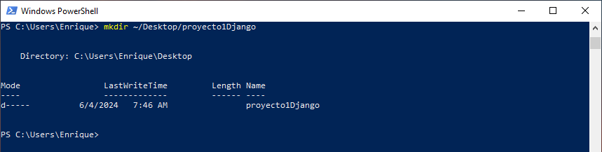

## Situarnos en el proyecto
```BASH
cd ~/Desktop/proyecto1Django
```

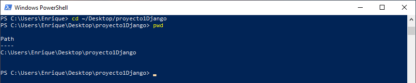

## Creación de un ambiente virtual

### MacOS
```BASH
python3 -m venv .venv
```

### Windows
```POWERSHELL
python -m venv .venv
```

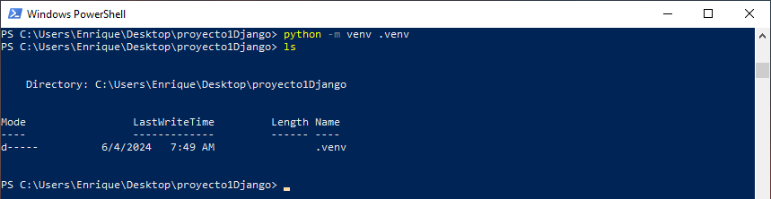

```POWERSHELL
Set-ExecutionPolicy -ExecutionPolicy RemoteSigned -Scope CurrentUser
```
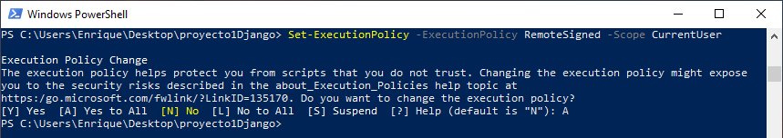

## Activar el ambiente virtual

### MacOS
```BASH
source .venv/bin/activate
```

### Windows
```POWERSHELL
.venv\Scripts\Activate.ps1
```

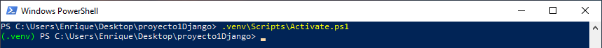

## Instalar Django
### Actualizar pip

```BASH
python -m pip install --upgrade pip
```

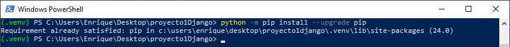

### Descargar Django

Puedes consultar las versiones desde el siguiente [sitio web](https://docs.djangoproject.com/en/5.0/releases/) 


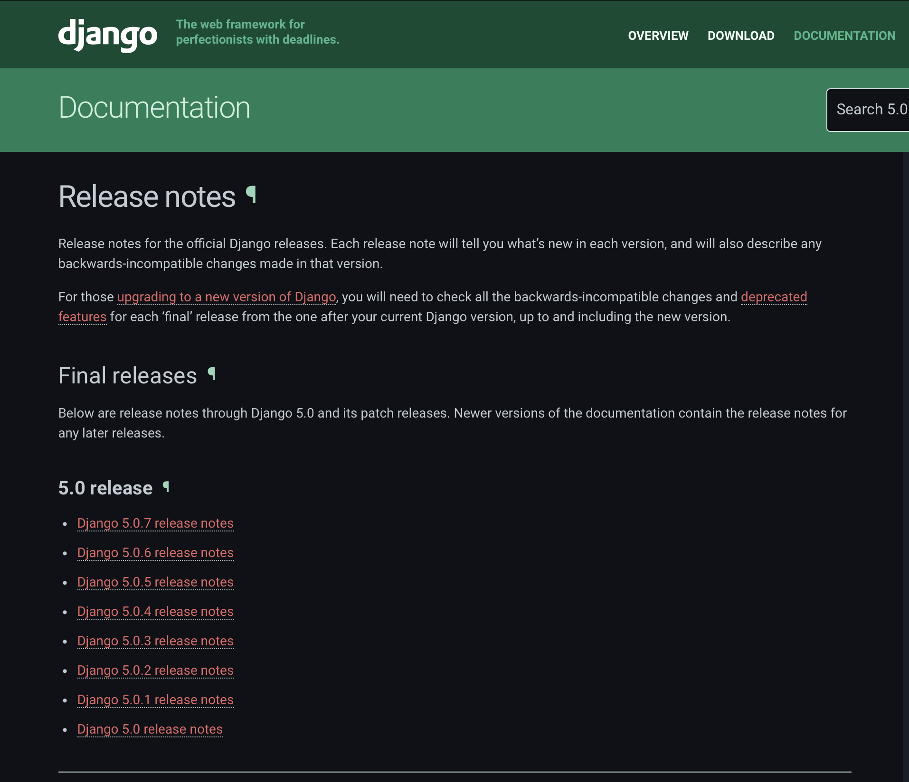

Recomendamos que siempre instales la versión más reciente disponible en el momento de creación de tu proyecto.


Nosotros instalaremos la versión `5.0.6`

```BASH
python -m pip install django~=5.0.6
```

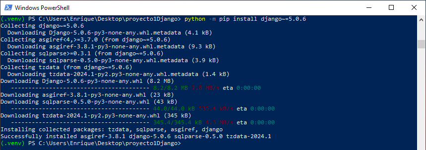

***

# Nuestro primer proyecto de Django

En la sección anterior instalamos todo lo necesario para trabajar con el framework, a partir de este momento haremos uso de sus herramientas para crear nuestro primer proyecto.

## Inicialización de proyecto

```BASH
django-admin startproject django_project .
```

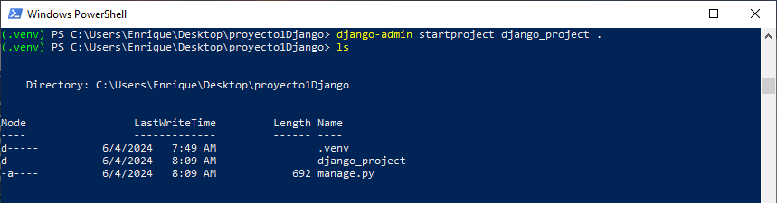

Después de la ejecución de este comando nuestra carpeta de proyecto `proyecto1Django` tendrá la siguiente estructura de directorios:

```python
proyecto1Django/
    ├── django_project
    │   ├── __init__.py
    │   ├── asgi.py
    │   ├── settings.py
    │   ├── urls.py
    │   └── wsgi.py
    ├── manage.py
    └── .venv/
```

??? note "¿Qué son los ficheros dentro de `django_project/`?"
    - `__init__`.py indica que los archivos de la carpeta son parte de un paquete de Python. Sin este archivo, no podemos importar archivos desde otro directorio.
    - `asgi.py` permite ejecutar un [Asynchronous Server Gateway Interface](https://en.wikipedia.org/wiki/Asynchronous_Server_Gateway_Interface) (opcional)
    - `settings.py` controla la configuración general de nuestro proyecto Django
    - `urls.py` le dice a Django qué páginas crear en respuesta a un navegador o solicitud de URL
    - `wsgi.py` significa [Web Server Gateway Interface](https://es.wikipedia.org/wiki/WSGI) que ayuda a Django a servir a nuestras eventuales páginas web.

## Ejecución de servidor de desarrollo

Si la configuración ha funcionado bien hasta el momento, nuestro proyecto debería ser capaz de mostrar una página de prueba que Django instaló automáticamente, para verla bastará con ejecutar el **servidor de desarrollo** mediante el siguiente comando:

```BASH
python manage.py runserver
```

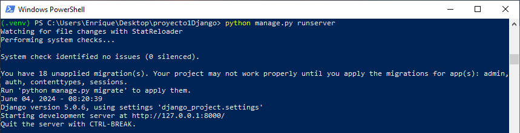

## Visitar página de proyecto

Ingresa a la siguiente URL: [http://127.0.0.1:8000/](http://127.0.0.1:8000/)

Deberás ver una pantalla como la siguiente:

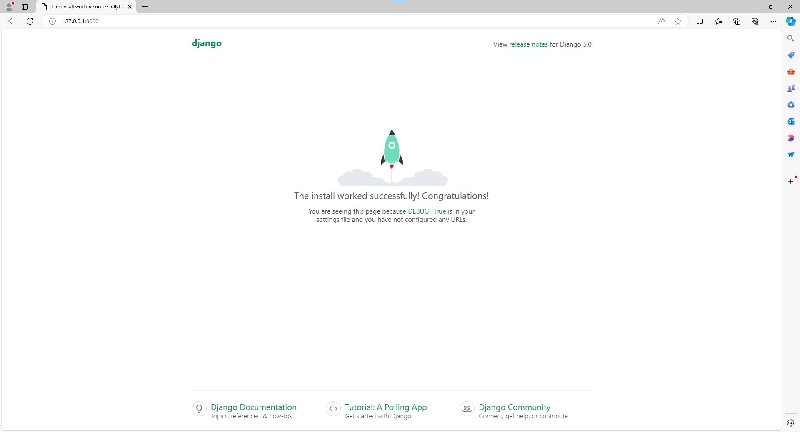

Si pudiste ver esta pantalla quiere decir que la instalación se realizó correctamente y podrás continuar desarrollando tu aplicación.

??? note "Ciclo de Solicitud/Respuesta HTTP"
    El HTTP (Protocolo de transferencia de hipertexto) fue creado inicialmente por Tim Berners-Lee en 1989 y es la base de la World Wide Web. Un protocolo de red es un conjunto de reglas para formatear y procesar datos. Es como un lenguaje común para las computadoras que les permite comunicarse entre sí incluso si están ubicadas en lados opuestos de la tierra y tienen hardware y software muy diferentes.
    
    HTTP es un protocolo de solicitud-respuesta que funciona en un modelo informático cliente-servidor. Cada vez que visita una página web, el "cliente" (es decir, tu computadora) envía una "solicitud" inicial y un "servidor" envía una "respuesta". El cliente no tiene por qué ser un ordenador, también puede ser un teléfono móvil o cualquier dispositivo conectado a Internet. Pero el proceso es el mismo: un cliente envía una solicitud HTTP a una URL y un servidor devuelve una respuesta HTTP.
    
    En última instancia, todo lo que hace un framework web como Django es aceptar solicitudes HTTP a una URL determinada y devolver una respuesta HTTP que contiene la información necesaria para representar una página web. Eso es todo. Generalmente, este proceso implica identificar la URL adecuada, conectarse a una base de datos, agregar algo de lógica, aplicar estilo con HTML/CSS/JavaScript y luego devolver la respuesta HTTP. Eso es todo.

    ```python
    Flujo de un framework web

    Solicitud HTTP  -> URL -> Combina base de datos, lógica, estilos -> Respuesta HTTP 
    ```


??? note "Modelo-Vista-Controlador vs Modelo-Vista-Template"
    Con el tiempo, el patrón Modelo-Vista-Controlador (MVC) ha surgido como una forma popular de separar internamente los datos, la lógica y la visualización de una aplicación en componentes separados. Esto facilita que un desarrollador razone sobre el código. El patrón MVC se usa ampliamente entre los frameworks web, incluidos `Ruby on Rails (Ruby)`, `Spring (Java)`, `Laravel (PHP)`, `ASP.NET (C#)` y muchos otros.

    En el patrón MVC tradicional hay tres componentes principales:

    - Modelo: gestiona datos y lógica empresarial central.
    - Vista: presenta datos del modelo en un formato particular.
    - Controlador: acepta entradas del usuario y realiza lógica específica de la aplicación

    Django sólo sigue vagamente el enfoque MVC tradicional con su propia versión a menudo llamada `Modelo-Vista-Template` (MVT). Inicialmente, esto puede resultar confuso para los desarrolladores con experiencia previa en marcos web. En realidad, el enfoque de Django es en realidad un patrón de 4 partes que también incorpora la configuración de URL, por lo que algo como `MVTU` sería una descripción más precisa.

    El patrón Django MVT es el siguiente:

    - Modelo: gestiona datos y lógica empresarial central.
    - Vista: Describe qué datos se envían al usuario pero no su presentación.
    - Template: presenta los datos como HTML con CSS y JavaScript. 
    - URL: Patrones que permiten acceder a una vista y su template asociado.

    Esta interacción es fundamental para Django pero muy confusa para los recién llegados, así que tracemos el orden de un ciclo de solicitud/respuesta HTTP determinado. 
    
    Cuando escribe una URL, como https://djangoproject.com, lo primero que sucede dentro de nuestro proyecto Django es que se encuentra un patrón de URL (contenido en urls.py) que coincide. El patrón de URL está vinculado a una vista única (contenida en views.py) que combina los datos del modelo (almacenados en models.py) y el estilo de una plantilla (cualquier archivo que termine en .html). Luego, la vista devuelve una respuesta HTTP al usuario.

    ```python
    Ciclo Solicitud/Respuesta de Django

    Solicitud HTTP -> URL -> Vista -> Modelo y Template -> Respuesta HTTP
    ```

## Creación de una aplicación

Django utiliza el concepto de `proyectos` y `aplicaciones` para mantener el código limpio y legible. Un único proyecto Django puede contener varias aplicaciones. Cada aplicación controla una funcionalidad aislada. 

Por ejemplo, un sitio de comercio electrónico puede tener:

- aplicación para la autenticación de usuarios
- aplicación para pagos 
- aplicación para mostrar detalles de la lista de artículos 

Son tres aplicaciones distintas que viven dentro de un proyecto. 

Cómo y cuándo dividir la funcionalidad en aplicaciones es algo subjetivo, pero en general, cada aplicación debe tener una función clara.

Crearemos una aplicación llamada `portafolio` mediante el siguiente comando:

```BASH
python manage.py startapp portafolio
```

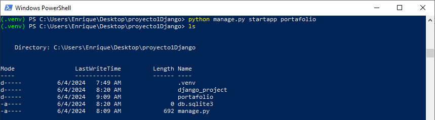

Notarás que se habrá creado un directorio homónimo a tu app con la siguiente estructura:

```python
├── portafolio
│   ├── __init__.py
│   ├── admin.py
│   ├── apps.py
│   ├── migrations
│   │   └── __init__.py
│   ├── models.py
│   ├── tests.py
│   └── views.py
```

??? note "¿Qué hacen los ficheros de mi nueva app?"
    - `admin.py` es un archivo de configuración para la aplicación integrada Django Admin
    - `apps.py` es un archivo de configuración para la propia aplicación
    - `migraciones/` realiza un seguimiento de cualquier cambio en nuestro archivo models.py para que permanezca sincronizado con nuestra base de datos
    - `models.py` es donde definimos nuestros modelos de base de datos que Django traduce automáticamente en tablas de bases de datos
    - `tests.py` es para pruebas específicas de aplicaciones
    - `views.py` es donde manejamos la lógica de solicitud/respuesta para nuestra aplicación web

## Añadir aplicación al proyecto

Aunque nuestra nueva aplicación existe dentro del proyecto, Django no la "sabe" hasta que la agregamos explícitamente al fichero `django_project/settings.py`. 

En tu editor de texto, abre el archivo y desplázate hacia abajo hasta que veas `INSTALLED_APPS`, donde habrá **seis** aplicaciones Django integradas. 

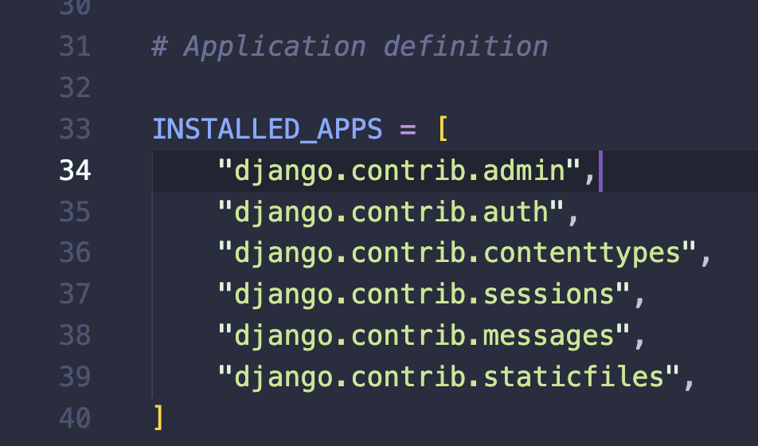

Agrega `"portafolio.apps.PortafolioConfig"` en la parte inferior.

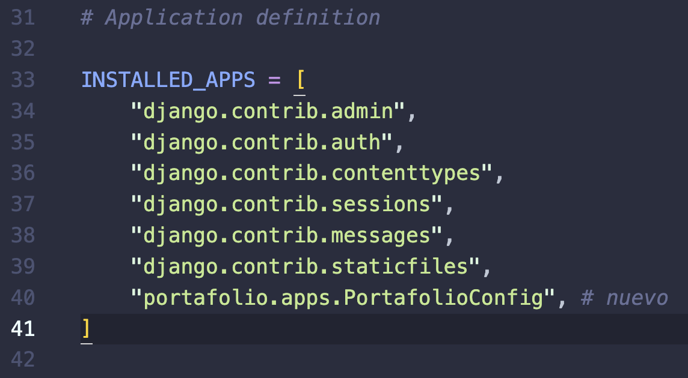

!!! tip "Añadir más apps"
    Conforme tu aplicación crezca crearás y añadiras nuevas aplicaciones, el proceso es el mismo solo cambiará el nombre del texto, si la app fuera `cotizacion`, deberías añadir `cotizacion.apps.CotizacionConfig`.

??? note "¿Qué es portafolio.apps.PortafolioConfig?"
    Si abres el fichero `portafolio/apps.py`

    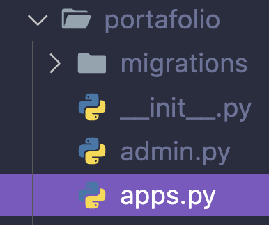

    Verás una función llamada `PortafolioConfig`, esta función permite a Django identificar tu app. 

    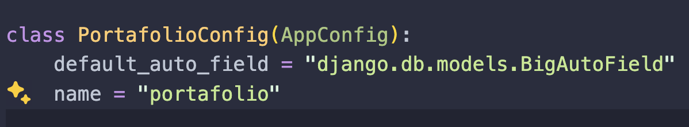

## Generar nuestra primera vista
Dirigete al fichero `portafolio/views.py`

Deberás ver un archivo casi vacío, salvo por el import.

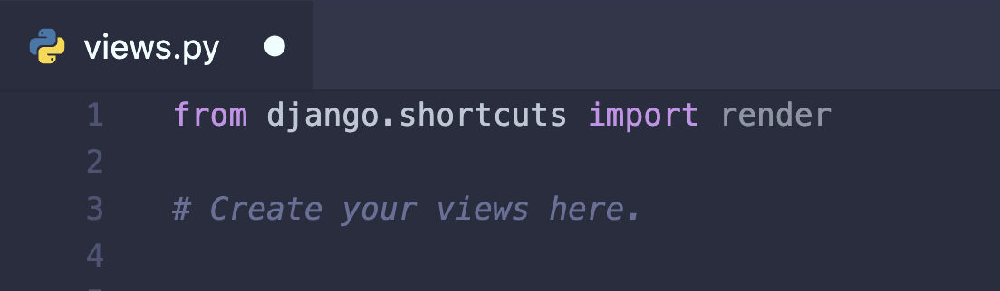

Sustituye el contendio por este código:

```PYTHON
from django.http import HttpResponse

def homePageView(request):
    return HttpResponse("Hello, World!")
```

Quedando el fichero de la siguiente manera:


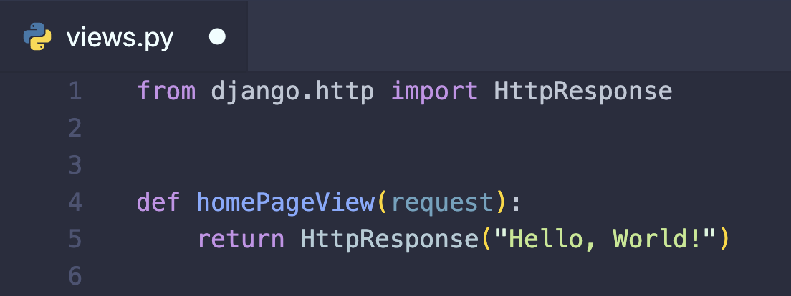

Básicamente, lo que hicimos fue hacer que cada que se llame a la función de vista `homePageView`, se devuelve el texto "Hello, World!".
 
Más específicamente, hemos importado el método integrado [HttpResponse](https://docs.djangoproject.com/en/4.0/ref/request-response/#django.http.HttpResponse)  para poder devolver un objeto de respuesta al usuario. 

Hemos creado una función llamada `homePageView` que acepta el objeto de `request` (solicitud) y devuelve una `HttpResponse` (respuesta) con la cadena "Hello, World!".

## Generar nuestra primera URL
1. Crea el fichero `portafolio/urls.py`
2. Dirigete al fichero `portafolio/urls.py`
3. Pega el siguiente código:

```python
from django.urls import path
from .views import homePageView

urlpatterns = [
    path("", homePageView, name="home"),
]
```
Tu archivo se verá de la siguiente manera:

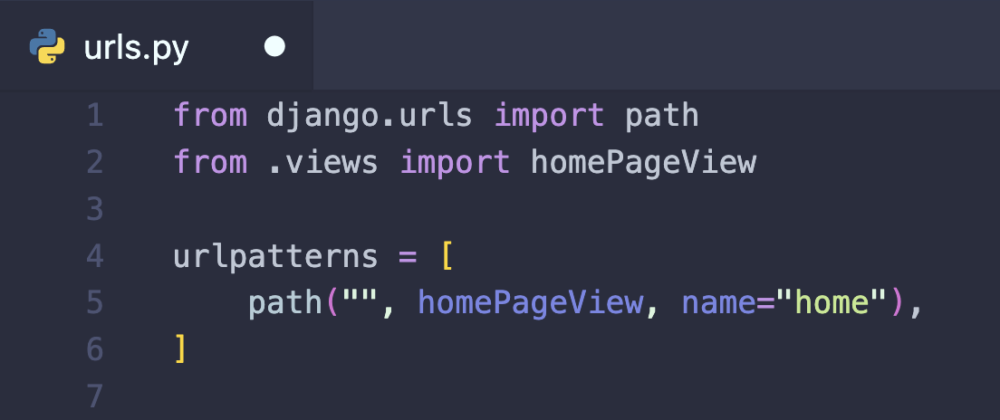

En la línea superior importamos `path` desde Django para dar funcionalidad a nuestro patrón de URL y en la siguiente línea importamos nuestras vistas. 

Al referirnos al archivo `views.py` como `.views`, le estamos diciendo a Django que busque en el directorio actual un archivo `views.py` e importe la vista `homePageView` desde allí.

Nuestro patrón de URL tiene tres partes:

- una expresión regular de Python para la cadena vacía `" "` 
- una referencia a la vista llamada `homePageView`
- un [patrón opcional de URL con nombre](https://docs.djangoproject.com/en/4.0/topics/http/urls/#naming-url-patterns) denominado "`home`".

En otras palabras, si el usuario solicita la página de inicio representada por la cadena vacía "", Django debería usar la vista llamada homePageView.

## Añadir las urls de nuestra app al proyecto

De manera análoga a cuando añadimos la aplicación al proyecto, debemos añadir las URLs de esta app a la configuración del proyecto. 

Para ello dirígete al fichero `django_project/urls.py`

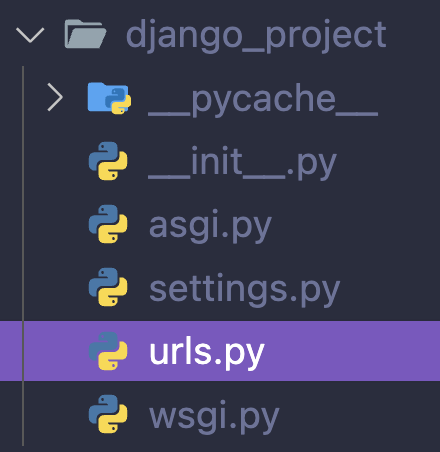

Se verá de la siguiente manera:

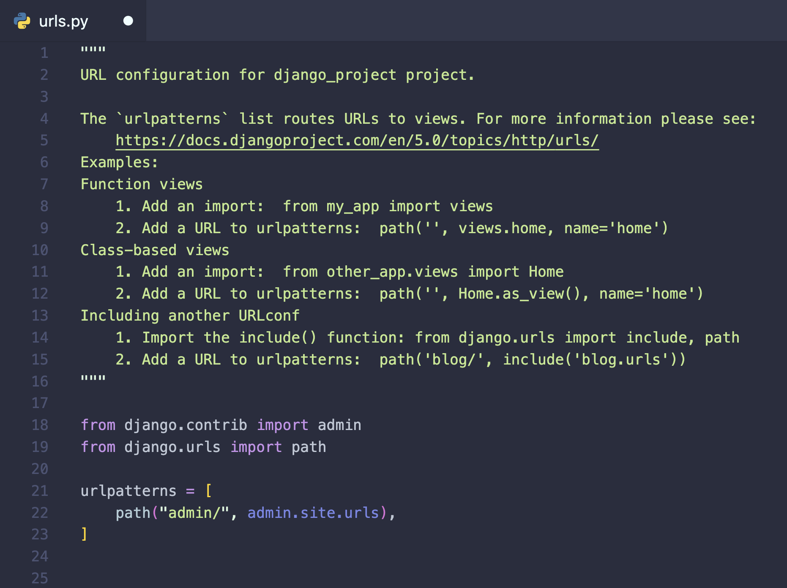

En la línea donde importa `path` escribe una coma y luego `include`.

Dentro del arreglo `urlpatterns` añade el siguiente patrón:

```python
path("", include("portafolio.urls")),
```

Quedando el archivo de la siguiente manera:

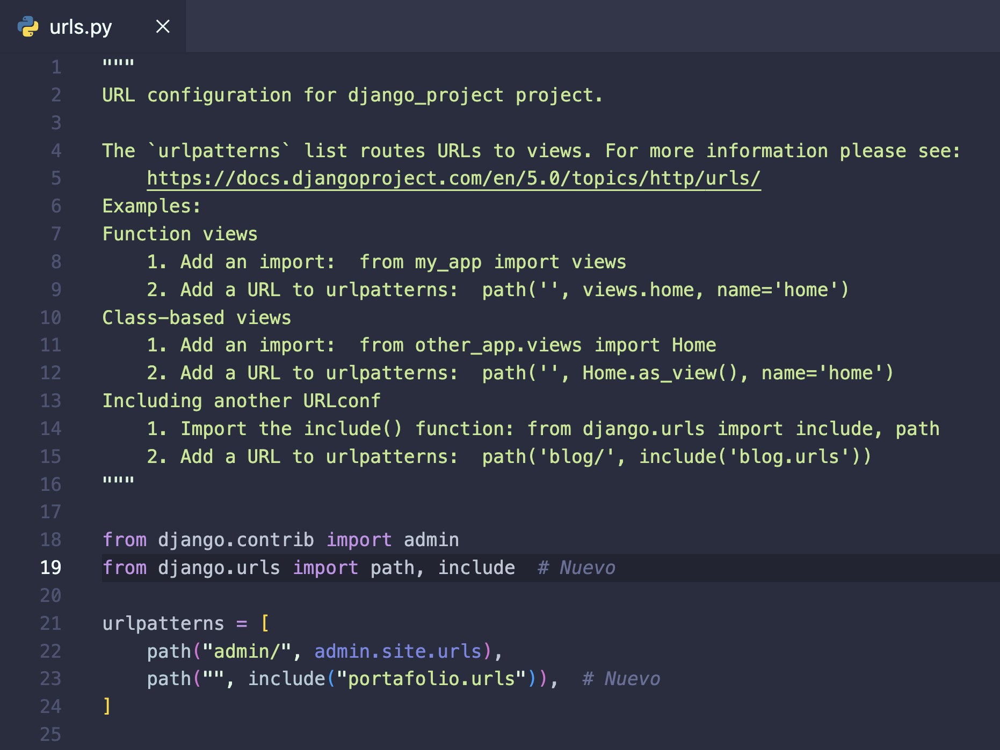

Si ejecutas el servidor de desarrollo con:

```BASH
python manage.py runserver
```

Y visitas la URL: [http://127.0.0.1:8000/](http://127.0.0.1:8000/) verás tu aplicación en acción. 

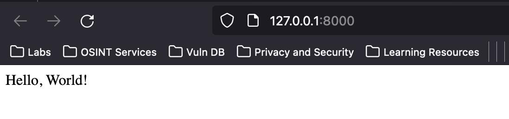

# Guardemos nuestro proyecto en un repositorio remoto

Primero al nivel de nuestra carpeta `proyecto1Django` crea un nuevo fichero llamado `.gitignore`.

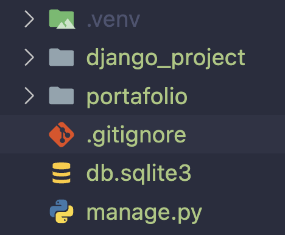

Dentro de dicho fichero añade la siguiente línea:

```GIT
.venv/
```

Ahora ejecutemos los siguientes comandos:

```BASH
git init
```

```BASH
git status
```

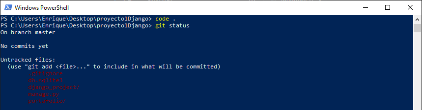

```BASH
git add -A
```

```BASH
git status
```

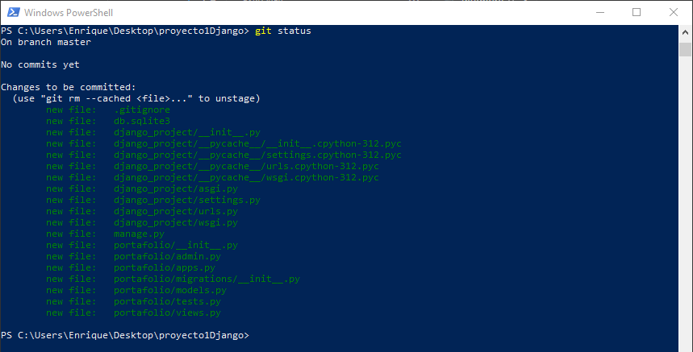

```BASH
git commit -m "Primer Commit"
```

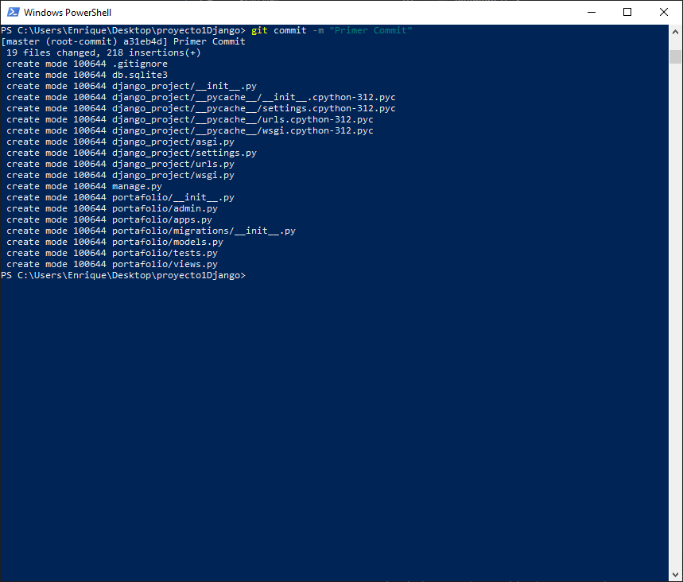

```BASH
git status
```

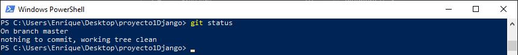

Crea un repositorio en github

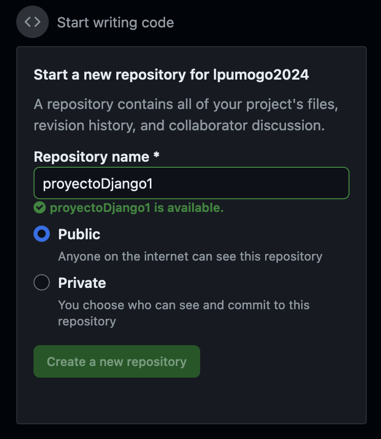

Usa los comandos que te sugiere inmediatamente después de crear el repositorio:

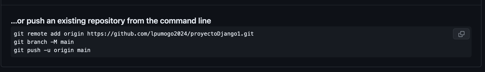
 
```BASH
git remote add origin https://github.com/lpumogo2024/proyectoDjango1.git
```
 
```BASH
git branch -M main
```

```BASH
git push -u origin main
```

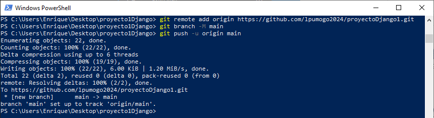

Si recargas la página de github donde creaste el repositorio deberías ver tus archivos:

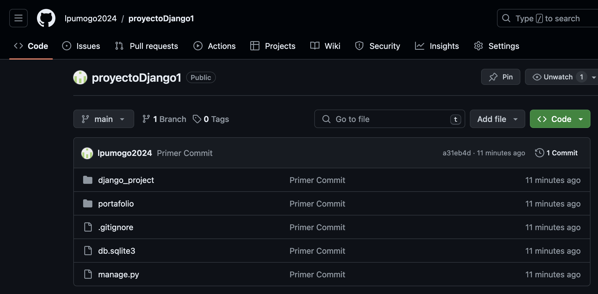

Si quisieras trabajar el proyecto en otro equipo deberías instalar todos los módulos usados en tu ambiente virtual mediante comandos de `pip install` si el proyecto es pequeño y se usan pocas librerías es posible, sin embargo, en un proyecto con muchas dependencias puede llevar a errores, por lo que se recomienda anotar todas las dependencias en un fichero llamado `requirements.txt`.

Muestra todas las dependencias con el comando:

```BASH
pip freeze
```

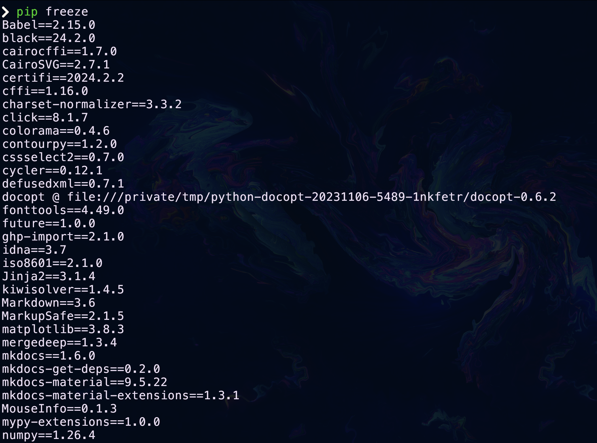

Podemos copiarlas y pegarlas en un fichero manualmente o emplear la redirección del `STDOUT` con el siguiente comando:

```BASH
pip freeze > requirements.txt
```

Se creará el fichero en automático con el contenido que muestra el comando `pip freeze`.

Ahora podemos seguir el flujo de guardar cambios incrementales en github con los siguientes comandos:

```BASH
git status
```

```BASH
git add -A
```

```BASH
git commit -m "Archivo requirements.txt"
```

```BASH
git push
```

```BASH
git status
```

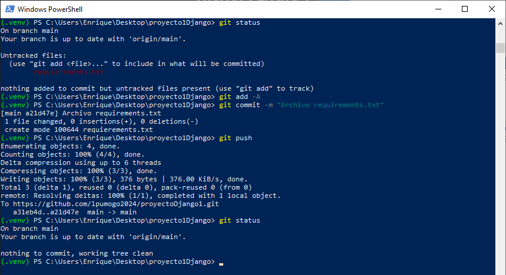

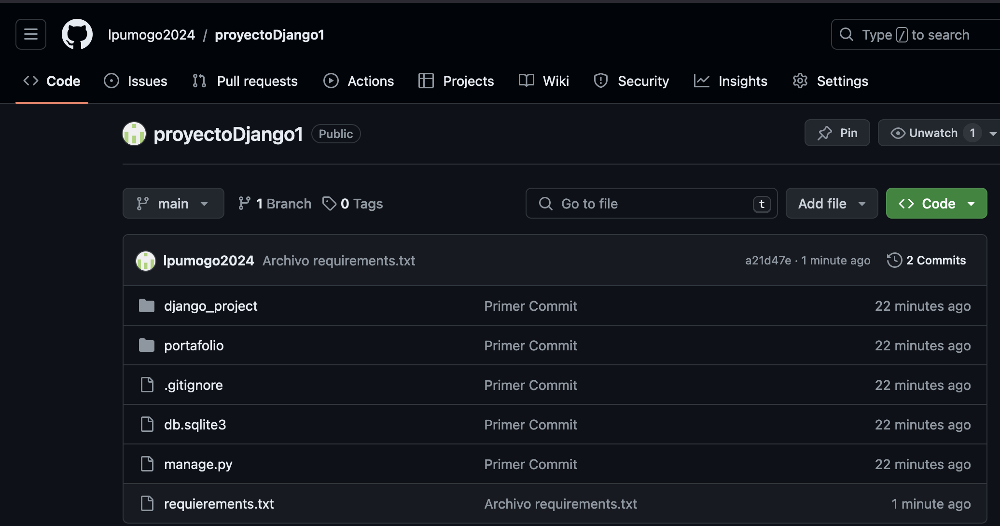