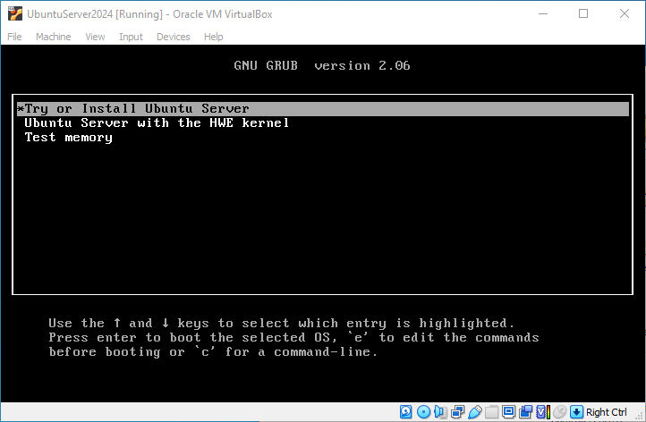

!!! note "Problemas con Mac y procesadores de la serie M"
    Si está usando una Mac con procesador de la serie M, VirtualBox no es compatible. Le sugerimos usar [UTM](https://mac.getutm.app) o [Parallels](https://www.parallels.com).

## Descargue la ISO de LINUX

Vaya al sitio oficial de Ubuntu haciendo [clic aquí](https://ubuntu.com/download/server) y descargue la última versión LTS de Ubuntu Server disponible.

Al ingresar, debería ver un sitio como este:


Haga clic en el botón verde que dice "Download Ubuntu Server ... LTS".

Si el navegador lanza una ventana emergente pidiéndole autorización para descargar, acéptela (el diseño de la ventana puede variar según el navegador).


El tamaño del archivo es bastante grande, así que puede seguir usando su equipo mientras continúa la descarga.


***

## Descargue e instale VirtualBox

Una vez que la descarga de la imagen de Linux haya terminado, continúe con la descarga del software VirtualBox. Diríjase a su sitio oficial haciendo [clic aquí](https://www.virtualbox.org). Verá una página como esta:


Haga clic en el recuadro azul que dice "Download VirtualBox ...", será redirigido a una página que se verá como la siguiente imagen, seleccione el sistema operativo en el que esté trabajando y se descargará un archivo ejecutable.


Una vez que la descarga esté lista, abra su explorador de archivos para buscar VirtualBox.


Ejecute el archivo recién descargado como administrador.


Siga los pasos de instalación:

1. Se iniciará el asistente de instalación, simplemente haga clic en "Next >".

    

2. Aquí podrá personalizar los parámetros de instalación. Le sugerimos que no modifique nada y simplemente haga clic en "Next >".

    

3. Nos advierte que la instalación del software podría causar interferencias con la red. Si está realizando algún trabajo para el cual es importante no perder la conexión, le sugerimos que detenga la instalación y continúe con ella una vez haya finalizado su trabajo. En caso de que pueda permitirse una breve desconexión, haga clic en "Yes".

    

4. Es posible que falten ciertas dependencias. Si es así, el asistente de instalación le mostrará una ventana como esta. Basta con hacer clic en "Yes" para que se instalen.

    

5. Una vez que se instalen las dependencias, el asistente estará listo para instalar VirtualBox. Haga clic en "Install" y espere a que se complete el proceso.

    

    

6. En cuanto finalice la instalación, el asistente le permitirá ejecutar el programa haciendo clic en "Finish".

    

7. Si el programa se abre y ve la siguiente interfaz, la instalación se ha completado con éxito.

    


***

## Cree una nueva VM en VirtualBox

1. Haga clic en "New".
    
    

2. Complete la información necesaria para continuar:
    - Asigne un nombre a su máquina, nosotros la llamaremos UbuntuServer2024.
    - Si es necesario, cambie la ubicación donde se guardará su máquina; nosotros la dejaremos en la carpeta por defecto.
    - Seleccione "Type" como "Linux".
    - Elija "Version" como "Ubuntu (64-bit)".

    Su pantalla debería lucir como sigue:
    
    
    Haga clic en "Next".

3. Configure el hardware según las siguientes recomendaciones (estos son los parámetros mínimos, pero si su equipo no está tan limitado en recursos, siéntase libre de aumentarlos):

    - Asigne "Base Memory" 1024 MB.
    - Asigne 1 CPU.
    - No habilite la casilla "Enable EFI".

    

    Haga clic en "Next". 

4. Administre los discos duros virtuales:

    - El tamaño mínimo del disco es 2.5 GB, mientras que el tamaño recomendado es de 5 GB.
    - No habilite ninguna otra opción en este menú.  

    

    Haga clic en "Next". 

5. Confirme que los parámetros de configuración sean correctos; en caso contrario, puede volver a los menús anteriores y corregir cualquier discrepancia. 

    

    Si todos los parámetros son correctos, haga clic en "Finish". 

6. La máquina debería aparecer en nuestro listado debajo del menú "Tools".

    

7. Haga clic derecho en la máquina recién creada y luego clic izquierdo en la opción "Settings".

    

    Aparecerá la siguiente ventana:

    

8. Seleccione la opción "Storage".

    

9. Haga clic derecho sobre la opción "Controller: IDE" y luego clic izquierdo en "Optical Drive".

    

10. En la nueva ventana, seleccione la opción "Add".

    

11. Busque la imagen ISO que descargamos al inicio de esta guía y selecciónela; probablemente se encuentre en la carpeta de descargas. Nosotros creamos un folder en el escritorio llamado "img" y allí está nuestra ISO.

    

    Haga clic en "Open".

12. La imagen ISO deberá aparecer en la ventana de selección de medios (Medium Selector); haga clic en ella y luego en "Choose".

    

13. En la ventana de configuraciones (Settings) de la máquina, cambie al menú "Network".

    

14. Para el "Adapter 1", asegúrese de lo siguiente:
    
    - La casilla "Enable Network Adapter" debe estar habilitada.
    - La opción "Attached to:" debe tener seleccionada la opción "Bridged Adapter".

    

    Si sus parámetros coinciden con los de la imagen, haga clic en "Ok".


***

## Instale Linux en su VM

1. Seleccione la máquina que recién configuró y luego haga clic en el botón "Start".

    

    Después de unos segundos, se cargará una pantalla de bienvenida.

    Al final de cada página habrá un botón que dice "Hecho" y otro que dice "Atrás". Utilice las teclas direccionales (flecha izquierda, flecha derecha, flecha arriba, flecha abajo) para navegar entre las opciones y seleccione mediante la tecla ENTER.

    Cuando esté satisfecho con las opciones seleccionadas, utilice las teclas direccionales para ir hacia abajo al botón "Hecho" y, cuando esté seleccionado, presione ENTER para ir a la siguiente página.

2. En la página del gestor de arranque, seleccione la opción "Try or Install Ubuntu Server"; la opción seleccionada estará destacada en color gris y aceptará la opción mediante ENTER.

    

    El gestor realizará una comprobación en la que se desplegará texto muy rápidamente; no se preocupe, es un proceso normal.

3. Seleccione su idioma; la opción seleccionada estará destacada en color verde.

    

4. Seleccione su distribución de teclado. Por defecto, nos colocará en la opción [Hecho]. Si la opción no es correcta, deberá subir a la opción "Disposición" y desplegar el menú de opciones mediante la tecla ESPACIO, navegar mediante las teclas direccionales y seleccionar mediante ENTER.

    

    

    

5. Elija el tipo de instalación; para este taller, usaremos la instalación "Ubuntu Server (minimized)".

    

6. Acepte las conexiones de red. Si configuró el adaptador de red como se especificó en el paso 13 de la sección anterior, el instalador detectará el DHCP automáticamente y solo deberá seleccionar "Hecho".

    

7. Si necesita conectarse mediante un proxy HTTP para tener acceso a Internet, aquí deberá ingresar la dirección del mismo; es muy probable que no lo necesite, así que simplemente seleccione "Hecho" para continuar.

    

8. En este paso, el instalador buscará conexión con unos servidores llamados "mirror", que sirven para la gestión de programas. Deberá esperar a que termine la prueba y seleccionar "Hecho".

    

9. Esta página se llama **Guided storage configuration**; como utilizaremos todo el espacio reservado para esta máquina virtual, debemos seleccionar la opción "Use an entire disk" como se muestra en la imagen. Si todo coincide con el ejemplo, seleccione "Hecho".

    

10. Confirme las preferencias de almacenamiento. No se preocupe si ha seguido la guía; las opciones que le aparecerán son correctas y solo deberá confirmarlas.

    

    Cuando seleccione "Hecho", aparecerá una nueva ventana que advierte sobre el formateo del disco. No se preocupe, se refiere al disco virtual asignado a la máquina con VirtualBox; sus archivos estarán bien, así que seleccione la opción "Continuar".

    

11. En este punto, deberá configurar el perfil de su servidor ingresando los siguientes datos:

    Daré mis datos como ejemplo; los suyos pueden ser distintos. No escriba con el teclado numérico porque no está soportado por la interfaz.

    - Su nombre: Enrique
    - Nombre de su servidor: 2nv21_main
    - Elija el nombre de usuario: adminupiicsa
    - Elija una contraseña: taller
    - Confirme la contraseña: taller

    

12. Se le preguntará si desea actualizar a Ubuntu Pro. Deje seleccionada la opción "Skip for now" y continúe.

    

13. En este paso, configuraremos el acceso remoto mediante el protocolo SSH (Secure Shell). Es muy importante que lo hagamos bien, ya que esta será la manera en la que nos conectaremos después.

    - Seleccione "Instalar servidor OpenSSH".
    - No importe identidad SSH.

    

14. Desplácese hacia abajo hasta la opción "Hecho" sin seleccionar ninguno de los paquetes listados; no son importantes por ahora.

    

15. Ahora deberá esperar unos minutos a que la instalación se complete. Cuando aparezca la leyenda "Ha finalizado la instalación", deberá seleccionar la opción "Reiniciar ahora".

    

    

## Ingrese por primera vez al sistema

Después del primer reinicio, el servidor mostrará una serie de mensajes que pueden parecer un error, pero en realidad es la misma comprobación de arranque que vimos al principio de la instalación.

En algún momento, una pantalla negra mostrará el nombre de nuestro servidor seguido por el texto "login" y un cursor que parpadea. Ahí deberemos usar las credenciales que configuramos en el paso 11 de la sección anterior.

1. Ingrese el nombre de usuario y presione ENTER.

    

2. Se solicitará la contraseña. Por motivos de seguridad, cuando escriba, no se mostrará la contraseña que ingrese, ni siquiera asteriscos `***`. Por lo tanto, ingrese su contraseña con mucho cuidado para evitar errores y así poder acceder al sistema.

    Si se equivoca, verá el mensaje "Login incorrecto" y deberá proporcionar nuevamente el nombre de usuario y la contraseña.
    
    

    Si ingresa la contraseña correctamente, verá un mensaje que dice "Welcome to Ubuntu ...".
    
    

3. Ingresamos algunos comandos iniciales para verificar que estamos dentro de nuestro servidor:

    Este comando nos permitirá corroborar el nombre de nuestro usuario.
    ```bash
    whoami
    ```

    Este comando nos permitirá obtener la información de nuestra interfaz de red. En concreto, nos interesa el número situado después de la leyenda "inet" (en mi caso 192.168.1.213), ya que esta es la dirección IP de nuestro servidor.
    ```bash
    ip address
    ```
    

Si pudimos ejecutar los dos comandos que se mostraron en el paso 3, nuestro servidor ya está funcionando. ¡Felicidades!


## Apaga tu máquina virtual

Solo escribe:

```BASH
sudo shutdown now
```

## Conclusión

Este material te puede servir como una muy básica guía de referencia para virtualizar servidores Ubuntu en Virtualbox, pero hay mucho más por aprender... mucho éxito en tu camino. 

Dirigete al [Módulo 2 - Conoce tu servidor](..//Curso/Módulo_02_Conoce_tu_servidor.md) para continuar con el taller.

!!! tip "Aún hay más..."
    Te invitamos a que investigues los siguientes conceptos:
        
    - VMware
    - Hypervisor
    - Bare Metal
    - MS Hyper-V


    


